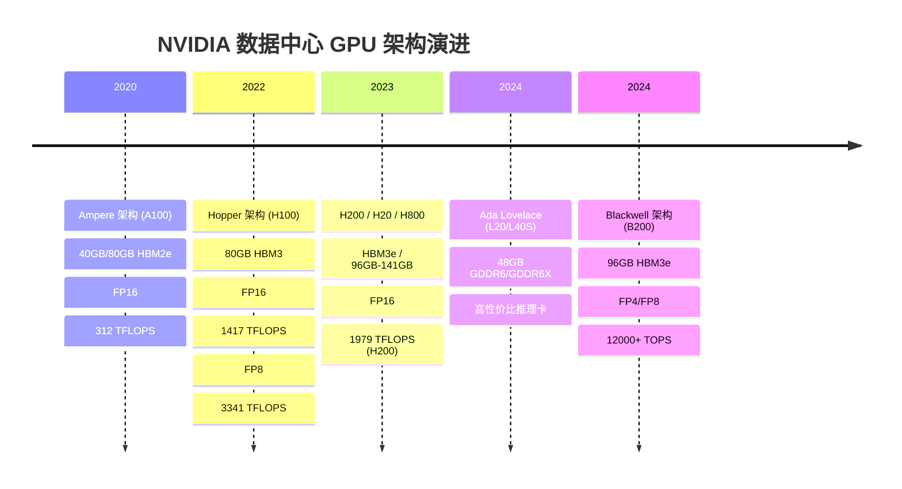
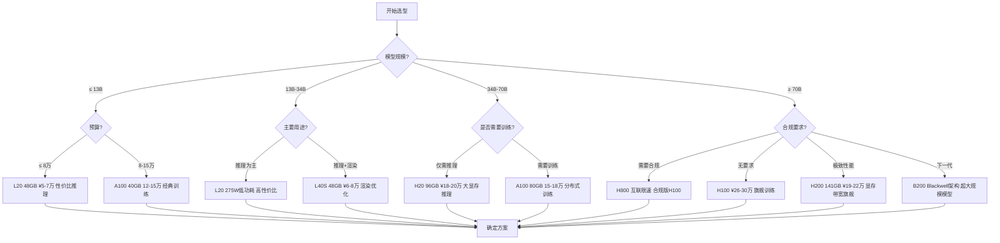
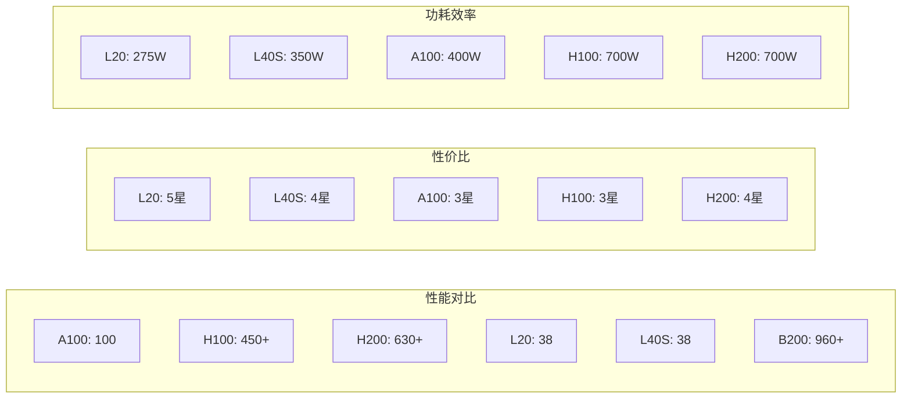
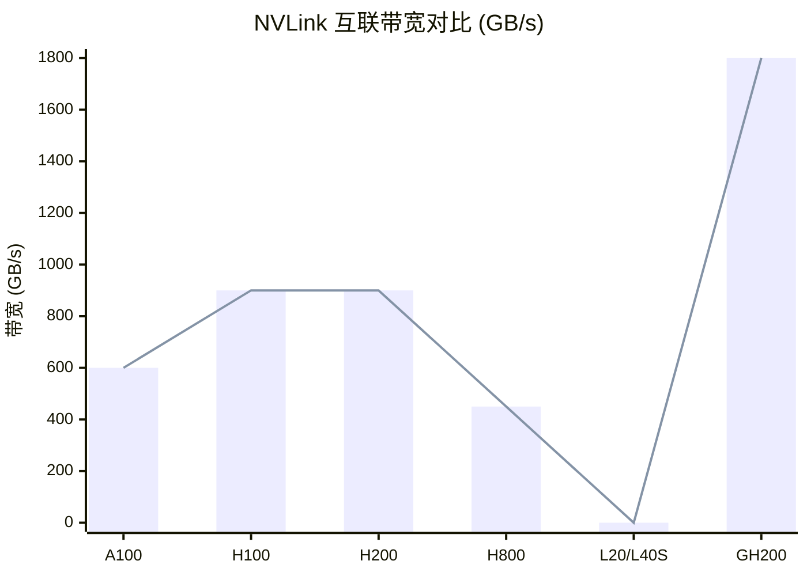

已为你在表格中添加NVIDIA L20（Ada Lovelace架构数据中心GPU，主打中大规模AI推理与专业视觉，高性价比低功耗），以下是更新后的完整对比表与关键说明。

---

## GPU 架构演进时间线

---

## GPU 选型决策图

---

## GPU 性能对比

---

## NVLink 互联带宽对比

---

### NVIDIA数据中心GPU参数、价格与性能对比表（含L20，2026年2月）
|型号|架构|CUDA核心|显存（容量/类型/带宽）|核心算力（FP16/BF16/FP8/FP32）|NVLink带宽|功耗（TDP）|参考价格（美元/人民币，2026.2）|核心性能定位|典型场景|
| :--- | :--- | :--- | :--- | :--- | :--- | :--- | :--- | :--- | :--- |
|A100 (40GB)|Ampere|6912|40GB HBM2e/1.6TB/s|FP16: 312 TFLOPS BF16: 312 TFLOPS FP32: 19.5 TFLOPS|600GB/s|400W|官价~19999/现货12-15万|经典AI训练/推理，分布式基础|13B以下模型推理，中规模训练|
|A100 (80GB)|Ampere|6912|80GB HBM2e/2TB/s|FP16: 312 TFLOPS BF16: 312 TFLOPS FP32: 19.5 TFLOPS|600GB/s|400W|官价~24999/现货15-18万|A100旗舰，大显存训练|34B模型推理，分布式训练|
|A800 (40GB/80GB)|Ampere|6912|40GB/80GB HBM2e/1.6TB/s/2TB/s|FP16: 312 TFLOPS BF16: 312 TFLOPS FP32: 19.5 TFLOPS|400GB/s（合规）|400W|现货13-16万（80GB）|A100合规版，性能一致|合规场景分布式训练/推理|
|H100|Hopper|18432|80GB HBM3/3.35TB/s|FP16: 1417 TFLOPS BF16: 1417 TFLOPS FP8: 3341 TFLOPS FP32: 70.85 TFLOPS|900GB/s|700W|官价36999/现货26-30万|Hopper旗舰，AI训练主力|70B模型训练，超算HPC|
|H800|Hopper|18432|80GB HBM3/3.35TB/s|FP16: 1417 TFLOPS BF16: 1417 TFLOPS FP8: 3341 TFLOPS FP32: 70.85 TFLOPS|450GB/s（合规）|700W|现货25-28万|H100合规版，互联受限|合规大规模训练/推理|
|H20|Hopper|18432|96GB HBM3/3.0TB/s|FP16: 148 TFLOPS BF16: 148 TFLOPS FP8: 296 TFLOPS FP32: 7.4 TFLOPS|无|700W|现货18-20万|合规大显存推理卡|70B模型单卡推理，合规部署|
|H200|Hopper|18432|141GB HBM3e/4.8TB/s|FP16: 1979 TFLOPS BF16: 1979 TFLOPS FP8: 3958 TFLOPS FP32: 98.95 TFLOPS|900GB/s|700W|官价~49999/现货19-22万|显存/带宽旗舰，低延迟推理|100B+模型推理，高吞吐训练|
|L20|Ada Lovelace|11776|48GB GDDR6 ECC/864GB/s|FP16: 119.5 TFLOPS BF16: 119.5 TFLOPS FP8: 239 TFLOPS FP32: 59.8 TFLOPS|无|275W|官价14974/现货5-7万|中规模推理+渲染，高性价比|13B-34B模型推理，3D渲染，边缘计算|
|L40S|Ada Lovelace|18176|48GB GDDR6X ECC/864GB/s|FP16: 119.5 TFLOPS BF16: 119.5 TFLOPS FP32: 59.8 TFLOPS|无|350W|现货6-8万|推理+渲染融合，高性价比|3D渲染，13B模型推理|
|B200 (Blackwell)|Blackwell|24576|96GB HBM3e/5.0TB/s|FP16: 3000+ TFLOPS BF16: 3000+ TFLOPS FP4/FP8混合: 12000+ TOPS FP32: 150+ TFLOPS|1.8TB/s|700W|预售~69999/现货35万+|下一代旗舰，能效跃升|超大规模模型训练/推理|
|GH200 (Grace+Hopper)|Hopper+Grace|18432|141GB HBM3e/4.8TB/s|FP8: 3958 TFLOPS FP32: 98.95 TFLOPS|CPU-GPU共享内存|800W|整机40-50万|CPU+GPU一体化，突破互联瓶颈|超大规模AI与HPC|

---

### L20关键补充说明
1.  **核心定位**：Ada Lovelace架构5nm制程，PCIe 4.0 x16，275W低功耗，支持MIG多实例分割，单卡可虚拟化多GPU提升利用率。
2.  **显存适配**：48GB GDDR6 ECC满足13B-34B模型推理（量化后），FP32算力强于H20，适合FP32依赖的科学计算与视觉任务。
3.  **成本优势**：比H系列低功耗低成本，比A100更适配中规模推理与渲染混合负载，边缘部署友好。
4.  **局限**：无NVLink，多卡互联效率低于Hopper，GDDR6带宽低于HBM3，不适合超大规模训练。

需要我按你的**模型规模（7B/13B/34B/70B+）** 和**部署形态（单卡/多卡/边缘）**，做一份“型号+显存+量化精度+功耗/散热”的极简选型清单吗？