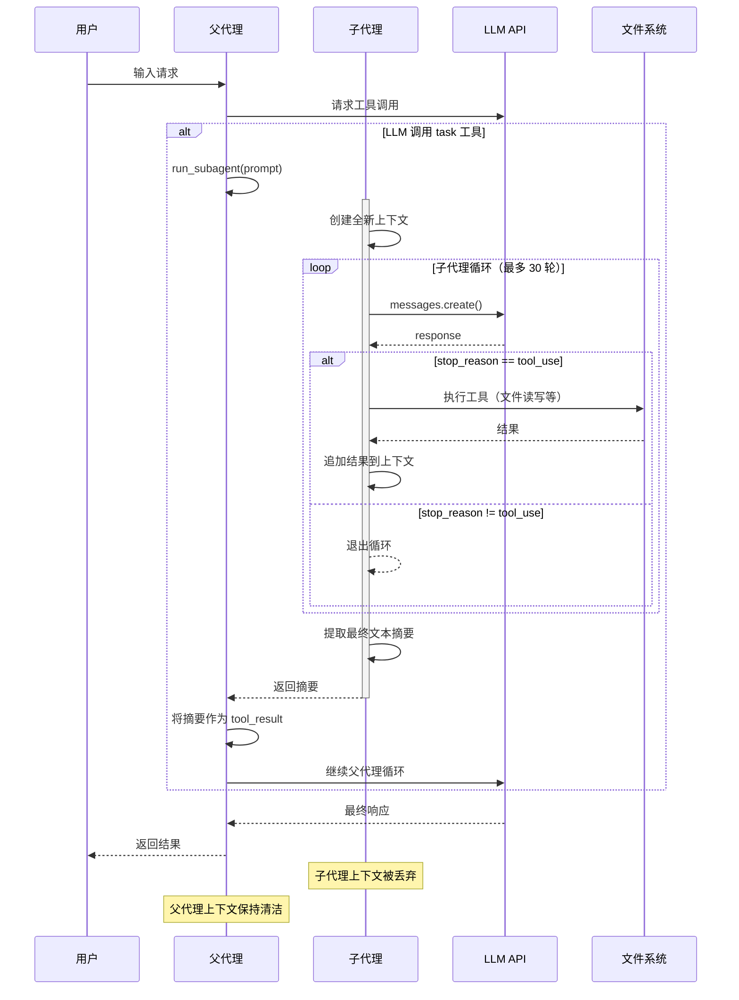
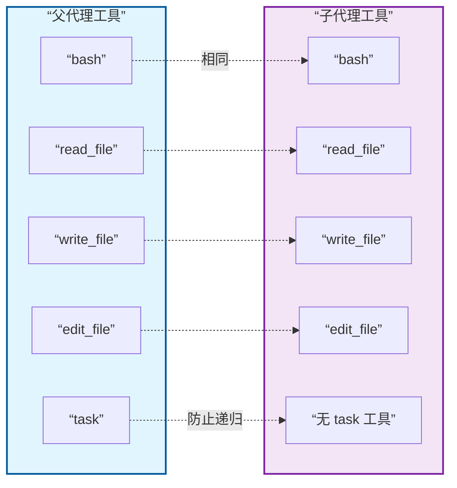
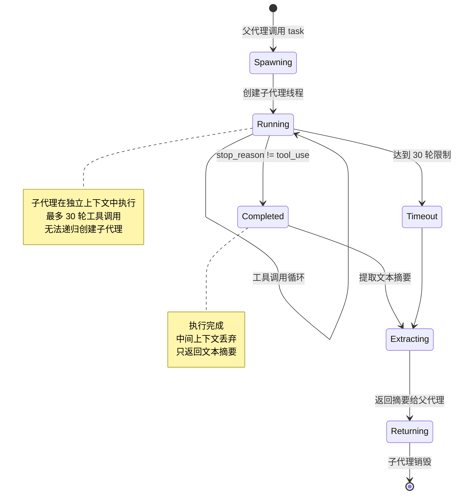
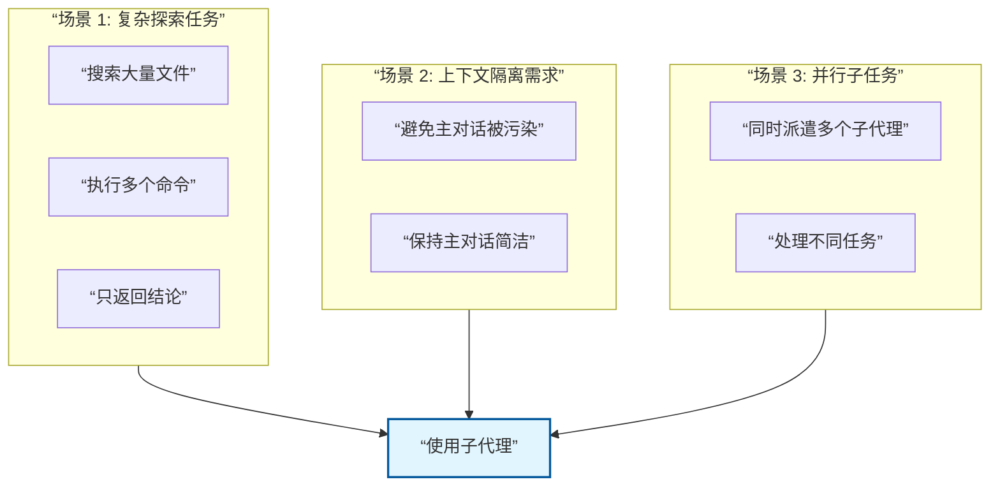

# S04 Subagent - 子代理流程图

本文档描述 `s04_subagent.py` 的子代理机制和执行流程。

---

## 1. 系统架构概览

```mermaid
graph TB
    subgraph Parent[“父代理 (Parent Agent)”]
        PLoop[“agent_loop()”]
        PTools[“工具集合<br/>bash, read, write, edit”]
        TaskTool[“task 工具<br/>派生子代理”]
    end

    subgraph Child[“子代理 (Subagent)”]
        CMessages[“messages = []<br/>全新上下文”]
        CLoop[“子代理循环<br/>最多 30 轮”]
        CTools[“基础工具<br/>无 task 工具”]
        Return[“返回摘要”]
    end

    subgraph FS[“文件系统 (共享)”]
        Files[“文件读写”]
    end

    PLoop -->|”调用 task”| TaskTool
    TaskTool -->|”启动”| CLoop
    CLoop --> CMessages
    CLoop --> CTools
    CTools --> Files
    CLoop -->|”完成”| Return
    Return --> PLoop

    style Parent fill:#e1f5fe,stroke:#01579b,stroke-width:2px
    style Child fill:#f3e5f5,stroke:#7b1fa2,stroke-width:2px
```

---

## 2. 子代理 vs 父代理对比

```mermaid
graph LR
    subgraph Subagent[“子代理 (Subagent)”]
        S1[“全新上下文<br/>messages = []”]
        S2[“基础工具”]
        S3[“摘要返回”]
        S4[“临时执行”]
    end

    subgraph Parent[“父代理 (Parent)”]
        P1[“继承上下文<br/>messages 继承”]
        P2[“全部工具<br/>含 task”]
        P3[“完整响应”]
        P4[“持久运行”]
    end

    S1 -.->|区别| P1
    S2 -.-> P2
    S3 -.-> P3
    S4 -.-> P4

    style Subagent fill:#f3e5f5,stroke:#7b1fa2,stroke-width:2px
    style Parent fill:#e1f5fe,stroke:#01579b,stroke-width:2px
```

---

## 3. 子代理执行流程 (run_subagent)

```mermaid
flowchart TD
    Start([run_subagent 调用]) --> Init[“sub_messages = []”]
    Init --> AddPrompt[“添加初始任务<br/>messages.append(prompt)”]

    AddPrompt --> ForLoop[“for _ in range(30)”]

    ForLoop --> CreateResp[“client.messages.create()”]
    CreateResp --> AppendResp[“messages.append(response)”]

    AppendResp --> CheckStop{“stop_reason<br/>== tool_use?”}

    CheckStop -->|”否”| Break[“break 退出循环”]
    CheckStop -->|”是”| ProcessTools[“处理工具调用”]

    ProcessTools --> ForTools[“遍历 tool_use 块”]
    ForTools --> GetHandler[“TOOL_HANDLERS.get(name)”]
    GetHandler --> ExecFunc[“执行函数”]
    ExecFunc --> AppendResult[“results.append()”]
    AppendResult --> ForTools

    ForTools -->|”完成”| AppendResults[“messages.append(results)”]
    AppendResults --> ForLoop

    Break --> Extract[“提取最后文本”]
    Extract --> Join[“''.join(block.text)”]
    Join --> CheckEmpty{“有文本?”}

    CheckEmpty -->|”是”| ReturnText([返回文本])
    CheckEmpty -->|”否”| ReturnNoop([返回 no summary])

    style Init fill:#e1f5fe,stroke:#01579b,stroke-width:2px
    style Break fill:#fff9c4,stroke:#f57f17,stroke-width:2px
```

---

## 4. 父子代理交互时序图



---

## 5. 上下文隔离示意图

```mermaid
graph TB
    subgraph Before[“子代理启动前”]
        PM[“父代理 messages<br/>[user_msg1, assist1,<br/>user_msg2, assist2]”]
    end

    subgraph During[“子代理执行中”]
        CM[“子代理 messages<br/>[user: prompt,<br/>assist: resp1,<br/>user: result1,<br/>...]”]
    end

    subgraph After[“子代理完成后”]
        PR[“父代理 messages<br/>[user_msg1, assist1,<br/>user_msg2, assist2,<br/>user: subagent_result]”]
        Note[“中间上下文<br/>已丢弃”]
    end

    PM -->|”派发”| During
    During -->|”摘要返回”| After

    CM -.->|丢弃| Note

    style During fill:#f3e5f5,stroke:#7b1fa2,stroke-width:2px
    style Note fill:#ffcdd2,stroke:#c62828,stroke-width:2px
```

---

## 6. 工具对比表



---

## 7. 数据结构

### 父代理消息结构
```python
messages = [
    {“role”: “user”, “content”: “用户输入”},
    {“role”: “assistant”, “content”: [...]},
    # ... 多轮对话
    {“role”: “user”, “content”: [
        {“type”: “tool_result”, “tool_use_id”: “...”, “content”: “子代理摘要”}
    ]}
]
```

### 子代理消息结构
```python
sub_messages = [
    {“role”: “user”, “content”: “任务提示”},
    {“role”: “assistant”, “content”: [...]},
    {“role”: “user”, “content”: [...]},
    # ... 独立执行，最多 30 轮
]
```

### 子代理返回摘要
```python
return “”.join(b.text for b in response.content if hasattr(b, “text”))
# 或 “(no summary)” 如果没有文本
```

---

## 8. 状态转换图



---

## 9. 四大关键特性

| 特性 | 说明 | 优势 |
|------|------|------|
| **上下文隔离** | 子代理从空白对话历史开始 | 避免上下文污染 |
| **文件系统共享** | 子代理可以读写父代理工作目录 | 通过文件传递结果 |
| **摘要返回** | 只返回最终文本，丢弃中间执行上下文 | 节省父代理的 token 使用 |
| **防止递归** | 子代理没有 task 工具 | 控制复杂度 |

---

## 10. 使用场景



---

## 11. 关键代码流程

```mermaid
flowchart LR
    A[“父代理”] --> B{“LLM 调用 task?”}
    B -->|”是”| C[“run_subagent()”]
    B -->|”否”| D[“执行其他工具”]

    C --> E[“子代理: 全新上下文”]
    E --> F[“子代理: 工具循环”]
    F --> G[“子代理: 返回摘要”]

    G --> H[“父代理: 注入摘要”]
    D --> H
    H --> I[“父代理: 继续 LLM 调用”]

    style C fill:#f3e5f5,stroke:#7b1fa2,stroke-width:2px
    style E fill:#f3e5f5,stroke:#7b1fa2,stroke-width:2px
    style F fill:#f3e5f5,stroke:#7b1fa2,stroke-width:2px
    style G fill:#f3e5f5,stroke:#7b1fa2,stroke-width:2px
```

---

## 12. 核心洞察

> **”Process isolation gives context isolation for free.”**
>
> 进程隔离自然带来上下文隔离。子代理在独立的消息上下文中执行，完成后只返回摘要，所有中间执行上下文都被丢弃。