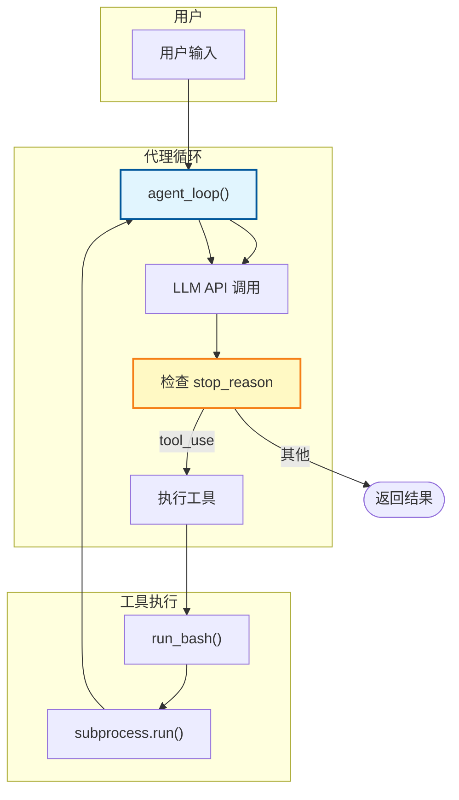
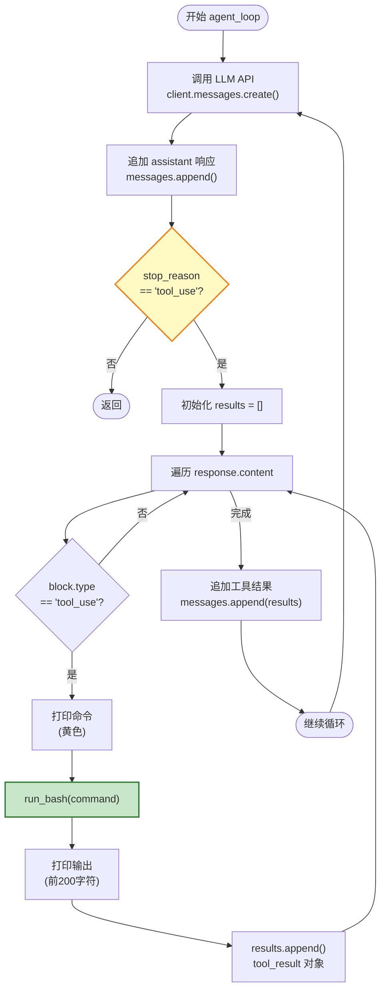
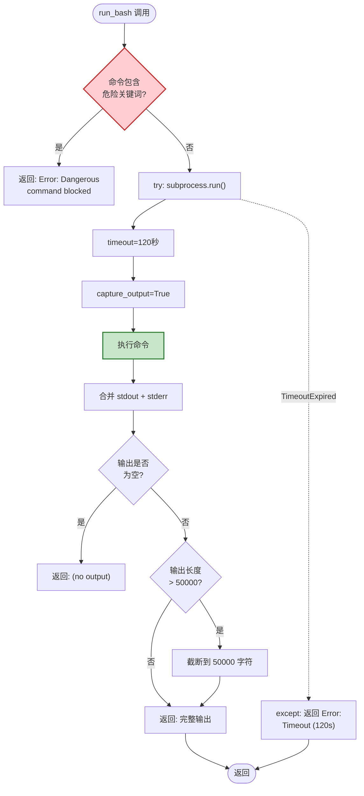
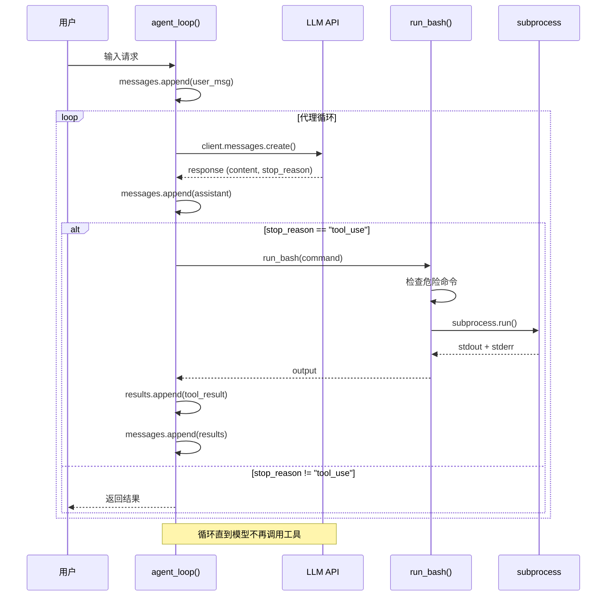
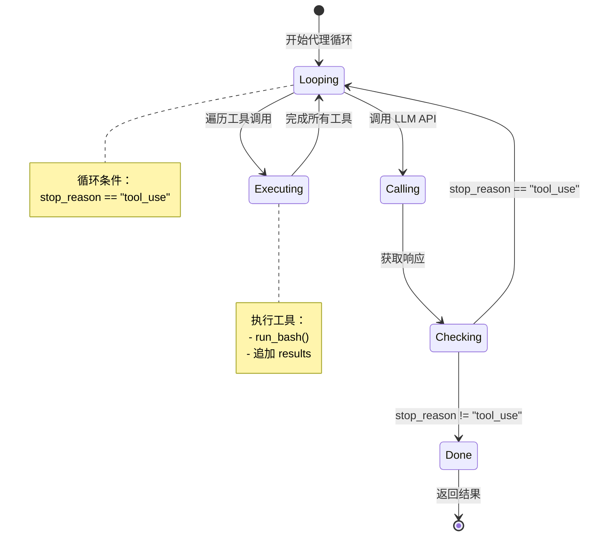

# S01 Agent Loop - 执行流程图

本文档描述 `s01_agent_loop.py` 的完整执行流程。

---

## 1. 系统架构概览



---

## 2. 代理主循环流程 (agent_loop)



---

## 3. 工具执行流程 (run_bash)



---

## 4. 完整时序图



---

## 5. 状态转换图



---

## 6. 数据结构

### messages 对话历史结构
```python
messages = [
    {"role": "user", "content": "用户输入"},
    {"role": "assistant", "content": [ContentBlock...]},  # LLM 响应
    {"role": "user", "content": [                       # 工具结果
        {"type": "tool_result", "tool_use_id": "...", "content": "输出"}
    ]},
    # ... 循环继续
]
```

### response.content 结构
```python
response.content = [
    ContentBlock(type="text", text="..."),           # 文本内容
    ContentBlock(type="tool_use",                    # 工具调用
        id="toolu_xxx",
        name="bash",
        input={"command": "ls"}
    )
]
```

### tool_result 对象结构
```python
{
    "type": "tool_result",
    "tool_use_id": "toolu_xxx",
    "content": "命令输出内容"
}
```

---

## 7. 关键特性总结

| 特性 | 说明 |
|------|------|
| **循环执行** | while stop_reason == "tool_use" 持续循环 |
| **结果反馈** | 工具执行结果作为下一条消息发送回模型 |
| **上下文累积** | 所有对话历史保存在 messages 列表中 |
| **危险命令检测** | 阻止执行破坏性命令 |
| **超时保护** | 命令执行最多 120 秒 |
| **输出限制** | 输出限制为 50000 字符 |
