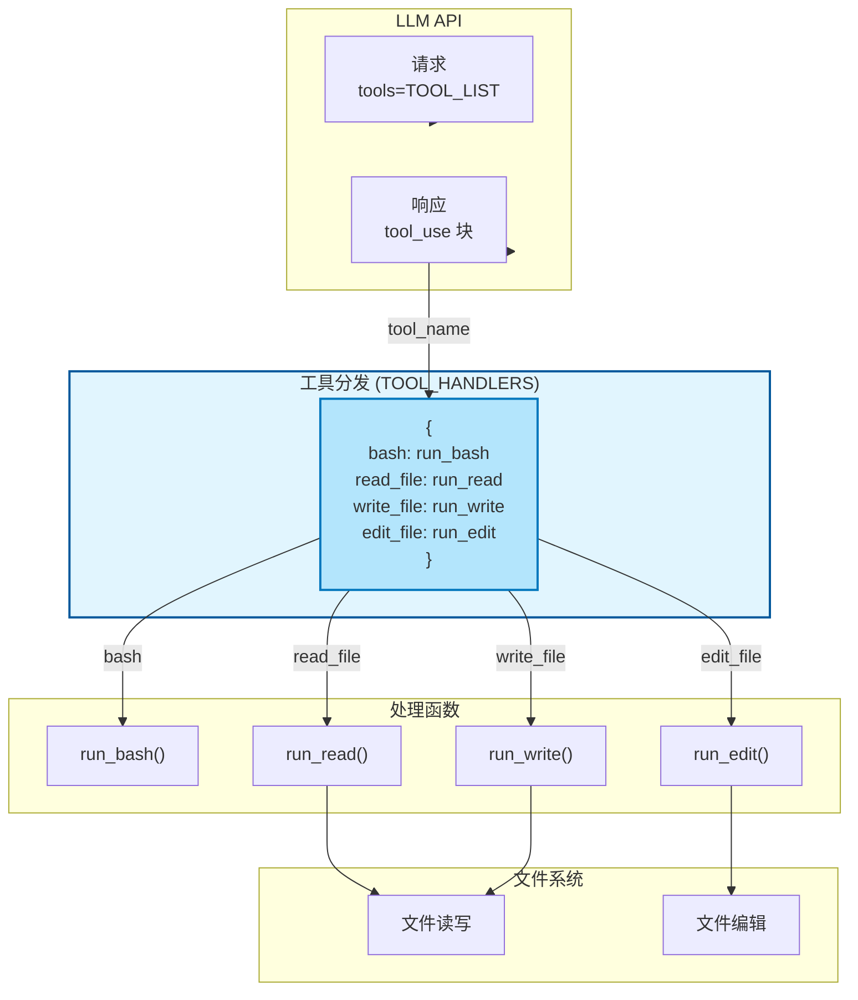
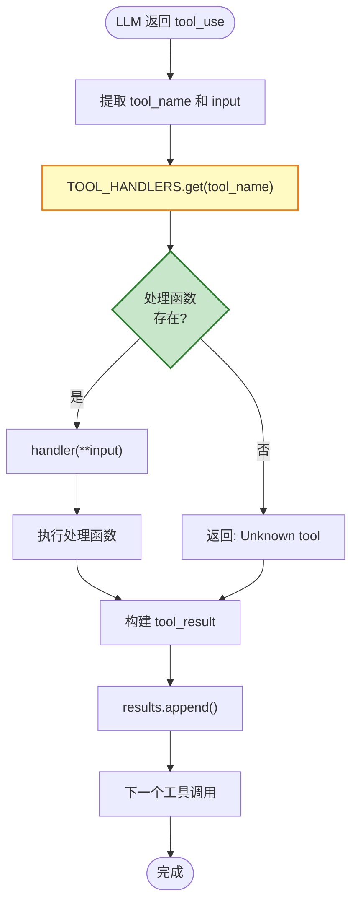
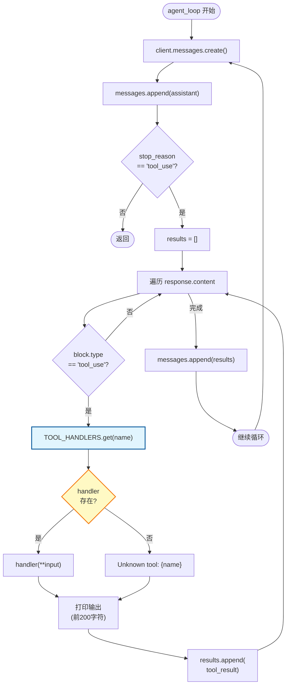
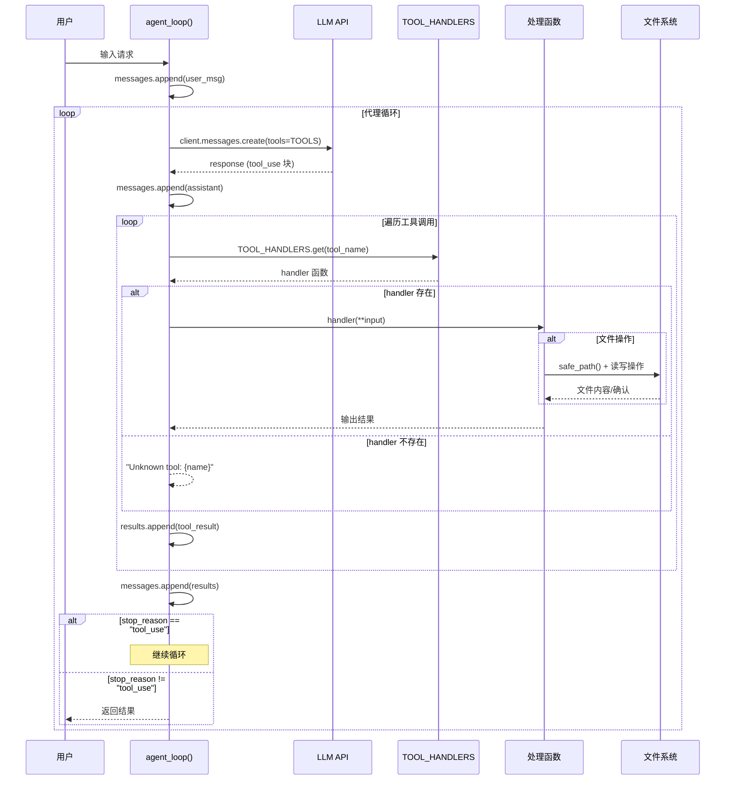
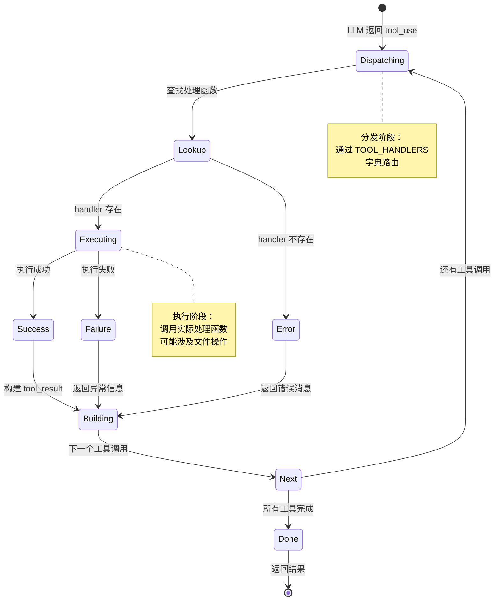
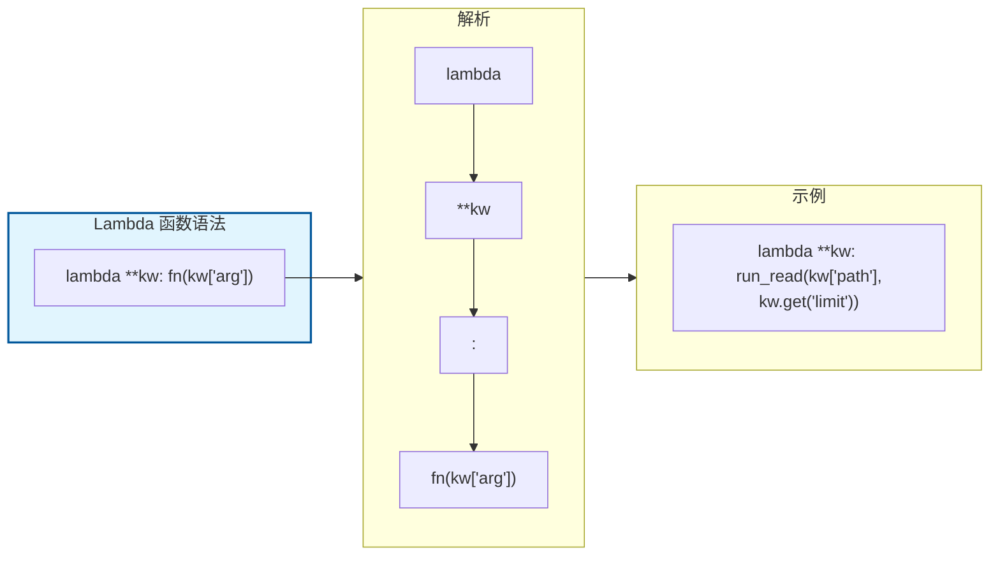

# S02 Tool Use - 工具分发流程图

本文档描述 `s02_tool_use.py` 的工具分发机制和执行流程。

---

## 1. 系统架构概览



---

## 2. 工具分发流程 (Dispatch Pattern)



---

## 3. 工具执行流程

```mermaid
flowchart TD
    subgraph BashTool["bash 工具"]
        B1["kw['command']"] --> B2["run_bash(command)"]
        B2 --> B3["subprocess.run()"]
        B3 --> B4["返回输出"]
    end

    subgraph ReadTool["read_file 工具"]
        R1["kw['path']"] --> R2["kw.get('limit')"]
        R2 --> R3["run_read(path, limit)"]
        R3 --> R4["safe_path()"]
        R4 --> R5["read_text()"]
        R5 --> R6["返回内容"]
    end

    subgraph WriteTool["write_file 工具"]
        W1["kw['path']"] --> W2["kw['content']"]
        W2 --> W3["run_write(path, content)"]
        W3 --> W4["safe_path()"]
        W4 --> W5["mkdir(exist_ok=True)"]
        W5 --> W6["write_text()"]
        W6 --> W7["返回字节数"]
    end

    subgraph EditTool["edit_file 工具"]
        E1["kw['path', 'old_text', 'new_text']"] --> E2["run_edit()"]
        E2 --> E3["read_text()"]
        E3 --> E4["replace(old, new, 1)"]
        E4 --> E5["write_text()"]
        E5 --> E6["返回 Edited 确认"]
    end
```



---

## 4. 代理主循环流程（集成分发）



---

## 5. 完整时序图



---

## 6. 数据结构

### TOOL_HANDLERS 分发映射
```python
TOOL_HANDLERS = {
    "bash":       lambda **kw: run_bash(kw["command"]),
    "read_file":  lambda **kw: run_read(kw["path"], kw.get("limit")),
    "write_file": lambda **kw: run_write(kw["path"], kw["content"]),
    "edit_file":  lambda **kw: run_edit(kw["path"], kw["old_text"], kw["new_text"]),
}
```

### TOOLS 工具定义
```python
TOOLS = [
    {
        "name": "bash",
        "description": "Run a shell command.",
        "input_schema": {
            "type": "object",
            "properties": {"command": {"type": "string"}},
            "required": ["command"]
        }
    },
    # ... 其他工具
]
```

### tool_use 块结构
```python
ContentBlock(
    type="tool_use",
    id="toolu_xxx",
    name="read_file",           # 工具名称
    input={"path": "file.txt"}  # 输入参数
)
```

### tool_result 对象结构
```python
{
    "type": "tool_result",
    "tool_use_id": "toolu_xxx",
    "content": "文件内容或错误消息"
}
```

---

## 7. 状态转换图



---

## 8. Lambda 函数语法说明



### Lambda 各部分说明
| 部分 | 说明 | 示例 |
|------|------|------|
| `lambda` | 匿名函数关键字 | 定义一个无名函数 |
| `**kw` | 接收任意关键字参数 | 将参数打包成字典 |
| `:` | 分隔符 | 分隔参数和函数体 |
| `fn(kw['arg'])` | 函数体 | 调用实际处理函数 |

---

## 9. 关键特性总结

| 特性 | 说明 |
|------|------|
| **解耦架构** | 工具定义与处理逻辑通过字典映射分离 |
| **可扩展性** | 添加新工具只需在字典中添加条目 |
| **类型安全** | 通过 input_schema 定义参数结构 |
| **错误处理** | 未知工具返回友好的错误消息 |
| **Lambda 匿名函数** | 使用 lambda 函数简化分发逻辑 |
| **安全路径检查** | 所有文件操作都经过 safe_path 验证 |
