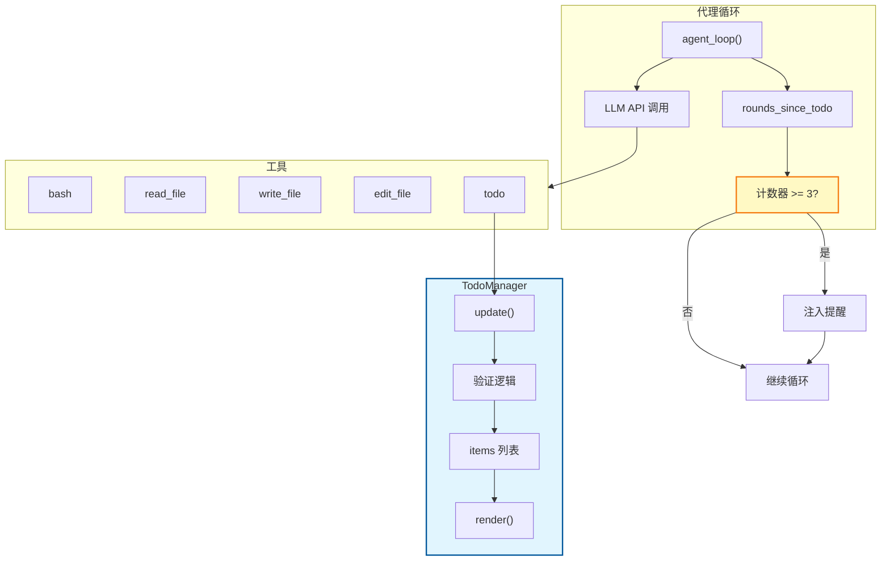
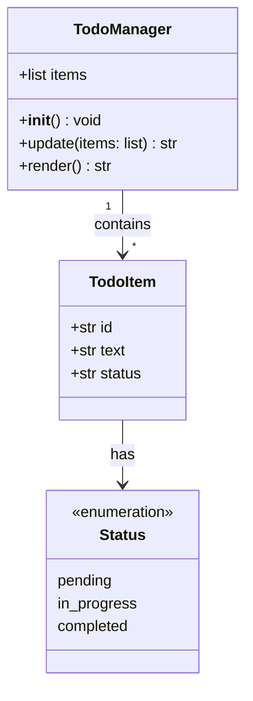
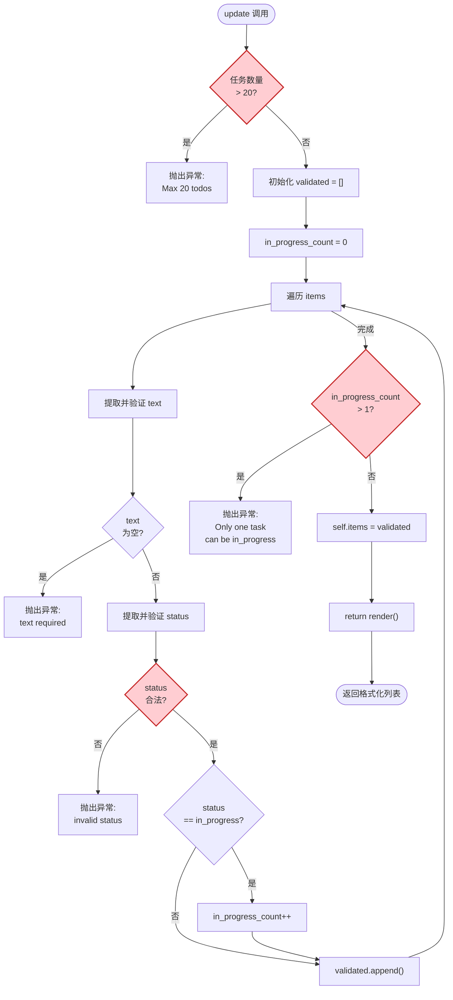
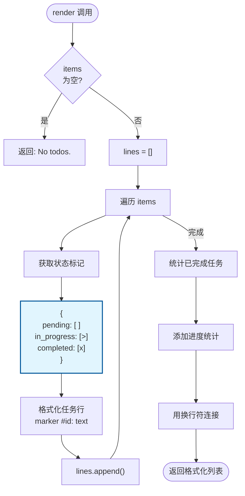
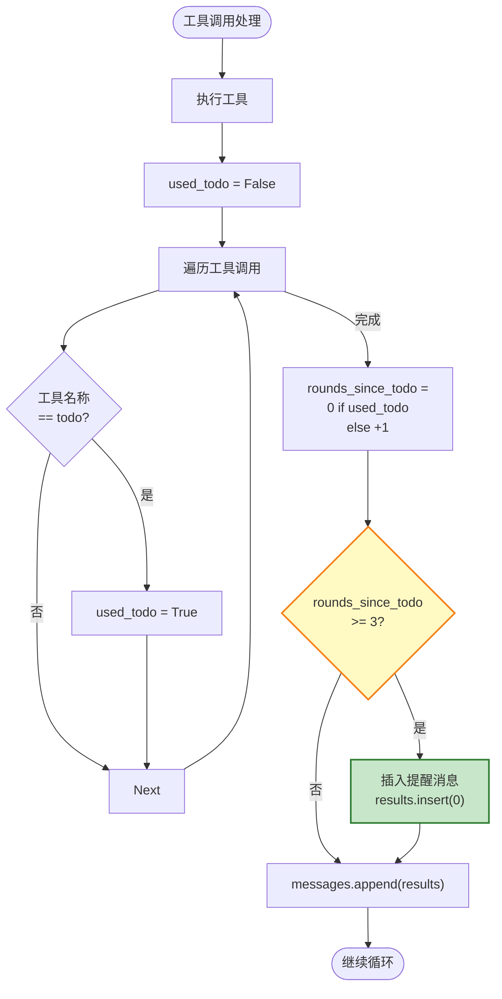
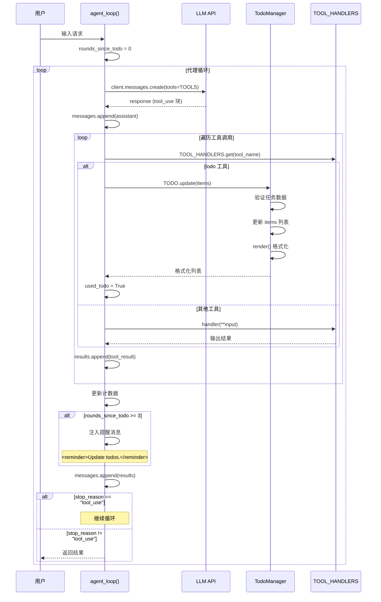
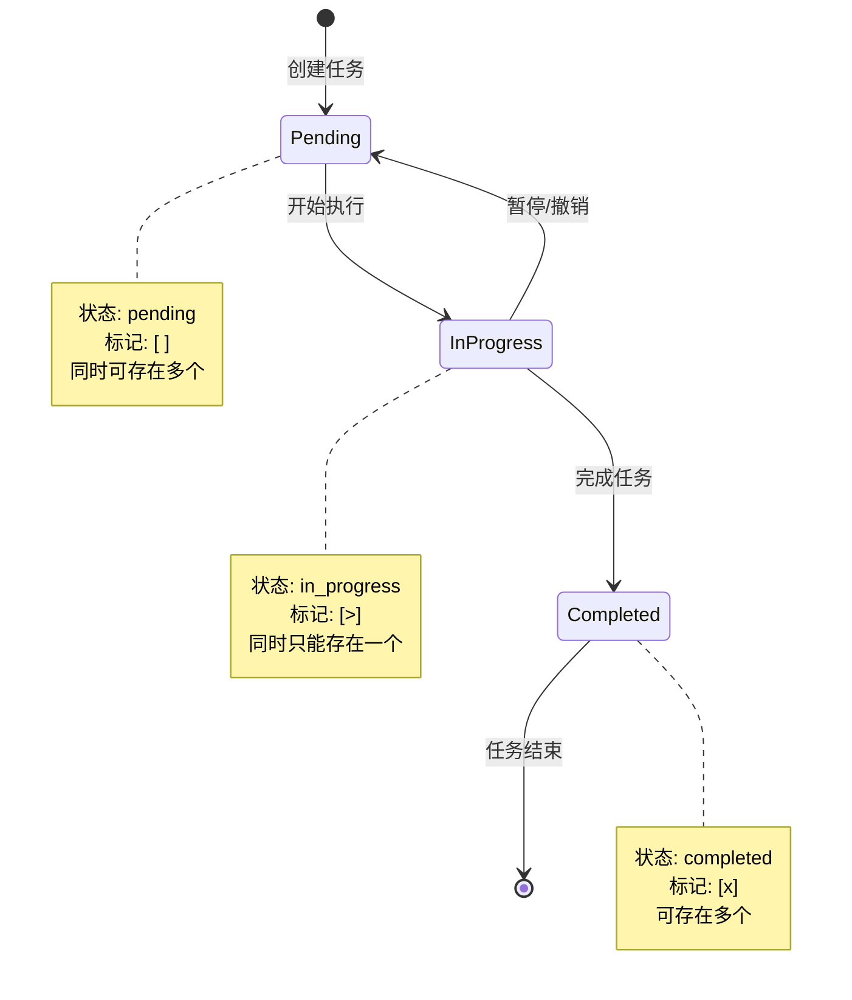
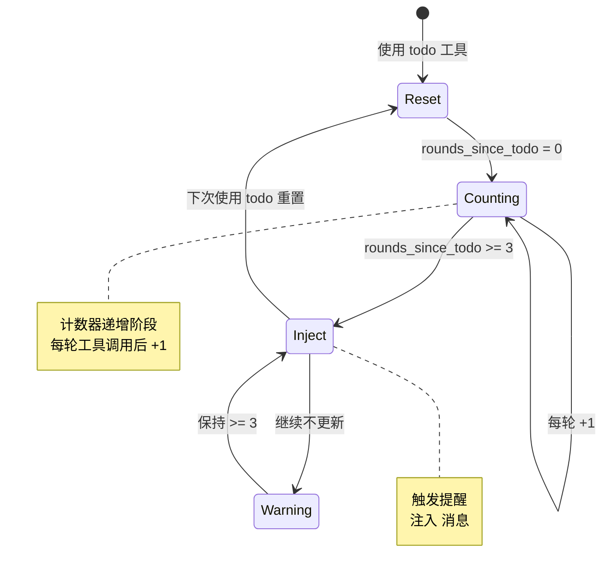

# S03 Todo Write - 待办事项管理流程图

本文档描述 `s03_todo_write.py` 的待办事项管理机制和提醒流程。

---

## 1. 系统架构概览



---

## 2. TodoManager 类结构



---

## 3. 任务更新流程 (update 方法)



---

## 4. 任务渲染流程 (render 方法)



---

## 5. 提醒机制流程



---

## 6. 完整时序图



---

## 7. 状态转换图



---

## 8. 提醒机制状态图



---

## 9. 数据结构

### items 列表结构
```python
items = [
    {
        "id": "1",              # 任务 ID
        "text": "任务描述",      # 任务文本
        "status": "pending"     # 状态: pending | in_progress | completed
    },
    # ... 更多任务
]
```

### todo 工具输入结构
```python
{
    "items": [
        {
            "id": "1",
            "text": "完成登录功能",
            "status": "in_progress"
        },
        {
            "id": "2",
            "text": "编写测试用例",
            "status": "pending"
        }
    ]
}
```

### 渲染输出格式
```
[ ] #1: 任务 A
[>] #2: 任务 B  <- 进行中
[x] #3: 任务 C

(1/3 completed)
```

---

## 10. 关键特性总结

| 特性 | 说明 |
|------|------|
| **自我跟踪** | 代理主动跟踪和更新任务进度 |
| **可视化** | 状态标记 [ ] [>] [x] 让进度一目了然 |
| **约束** | 同时只能有一个 in_progress 任务 |
| **提醒** | 超过 3 轮未更新自动注入提醒 |
| **限制** | 最多 20 个待办事项 |
| **验证** | 验证任务数据的合法性 |
