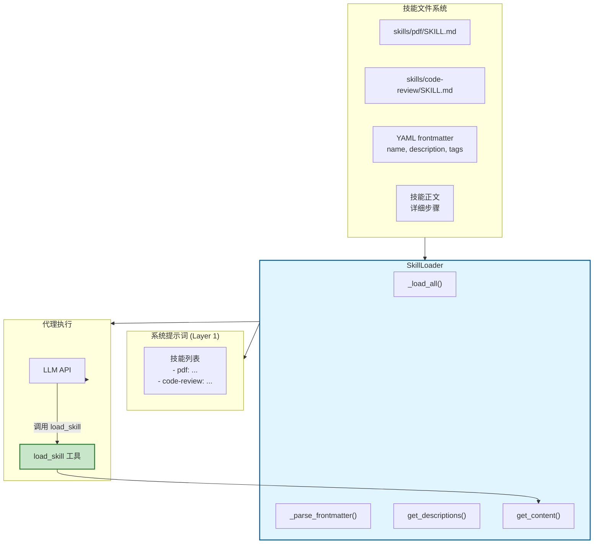
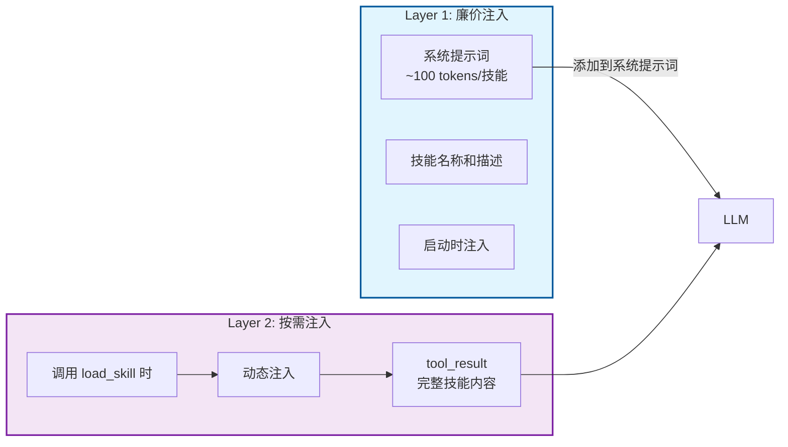
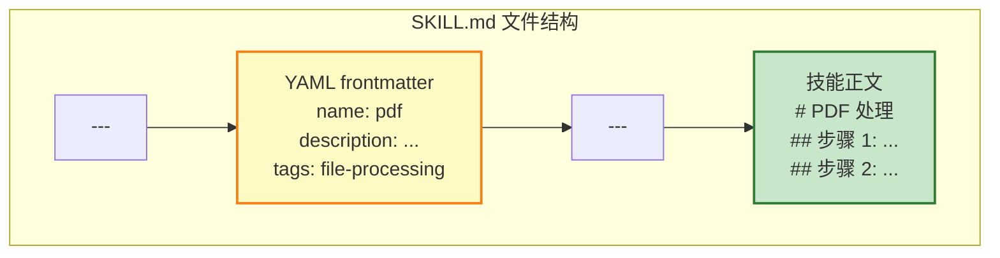
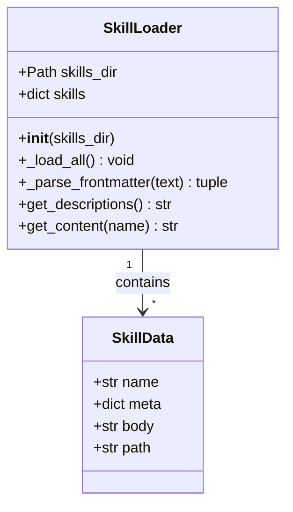
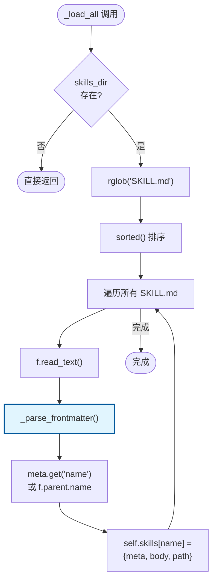
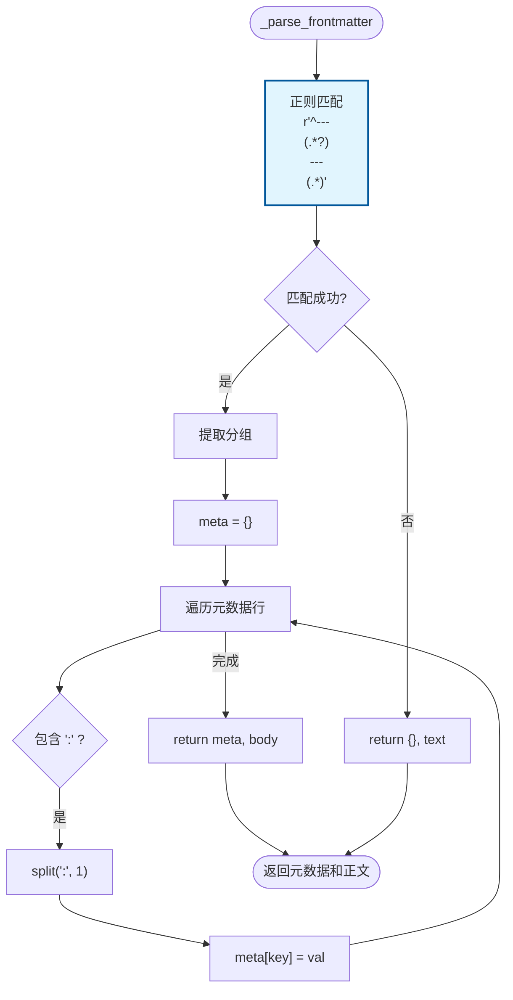
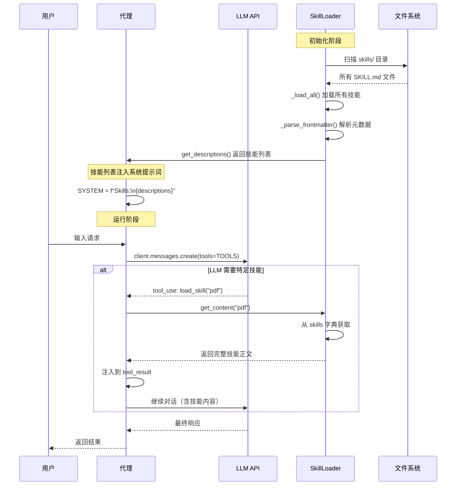
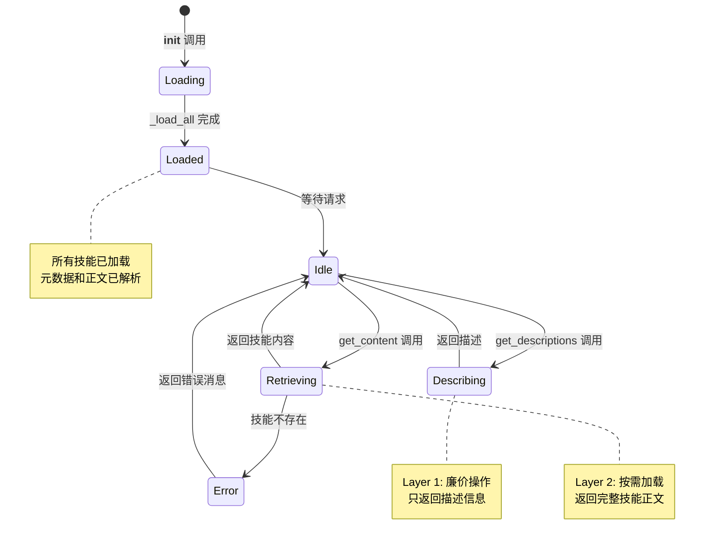

# S05 Skill Loading - 技能按需加载流程图

本文档描述 `s05_skill_loading.py` 的技能按需加载机制和执行流程。

---

## 1. 系统架构概览



---

## 2. 两层注入架构



---

## 3. 技能文件结构



---

## 4. SkillLoader 类结构



---

## 5. 技能加载流程 (_load_all)



---

## 6. Frontmatter 解析流程 (_parse_frontmatter)



---

## 7. 技能调用时序图



---

## 8. 数据结构

### skills 字典结构
```python
skills = {
    "pdf": {
        "meta": {
            "name": "pdf",
            "description": "Process PDF files...",
            "tags": "file-processing"
        },
        "body": "# PDF 处理\n\n## 步骤 1:...",
        "path": "skills/pdf/SKILL.md"
    },
    "code-review": {
        # ... 类似结构
    }
}
```

### SKILL.md 文件格式
```markdown
---
name: pdf
description: Process PDF files and extract content
tags: file-processing
---

# PDF 处理技能

## 步骤 1: 检查 PDF 是否存在
...

## 步骤 2: 提取文本内容
...
```

### get_descriptions 返回格式
```
  - pdf: Process PDF files and extract content [file-processing]
  - code-review: Review code for best practices [code-quality]
```

### get_content 返回格式
```xml
<skill name="pdf">
# PDF 处理技能

## 步骤 1: 检查 PDF 是否存在
...

## 步骤 2: 提取文本内容
...
</skill>
```

---

## 9. 状态转换图



---

## 10. 四大关键特性

| 特性 | 说明 | 优势 |
|------|------|------|
| **延迟加载** | 技能内容不在启动时加载 | 减少 token 消耗 |
| **模块化设计** | 每个技能是独立的文件 | 动态添加、删除、修改 |
| **两层注入** | Layer 1: 元数据 / Layer 2: 完整内容 | 避免系统提示词膨胀 |
| **可扩展性** | 支持大量技能 | 技能可以包含详细步骤 |

---

## 11. 关键特性总结

| 特性 | 说明 |
|------|------|
| **YAML frontmatter** | 技能元数据（name, description, tags） |
| **正则解析** | 使用正则表达式解析 frontmatter |
| **安全获取** | 使用 dict.get() 提供默认值 |
| **XML 包装** | 返回的技能内容用 XML 标签包裹 |

---

## 12. 核心洞察

> **"Don't put everything in the system prompt. Load on demand."**
>
> 不要把所有内容放在系统提示词中。按需加载。
