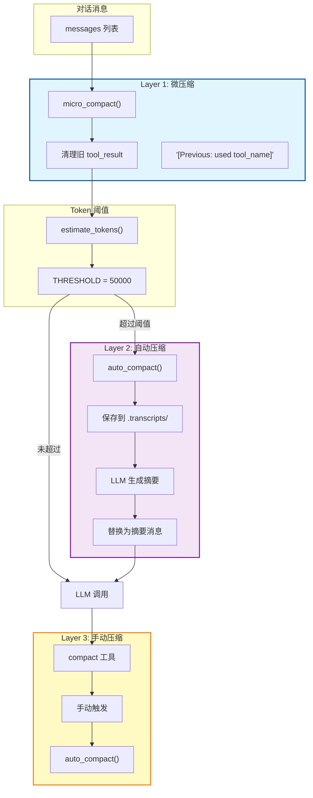
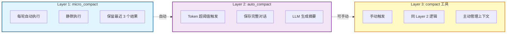
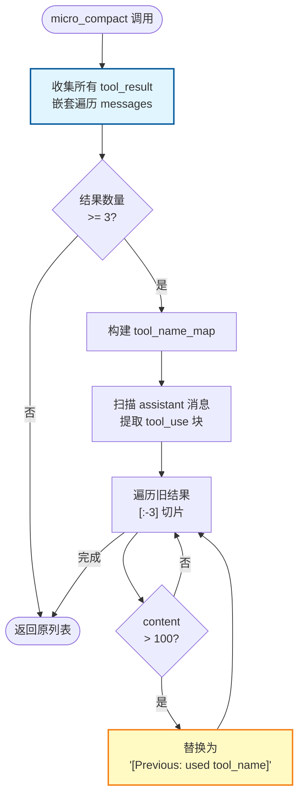
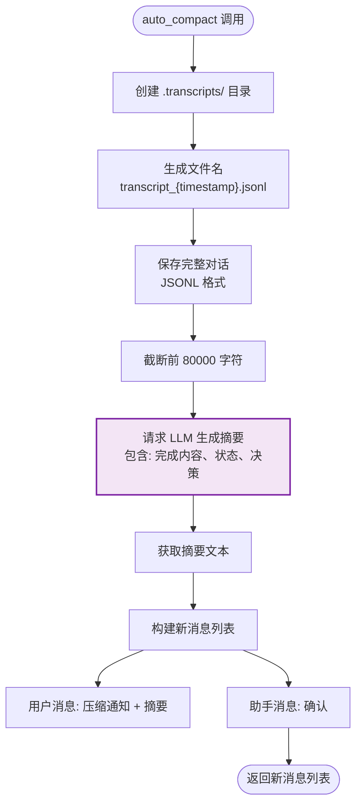
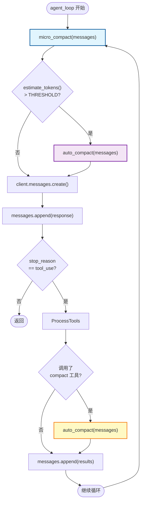
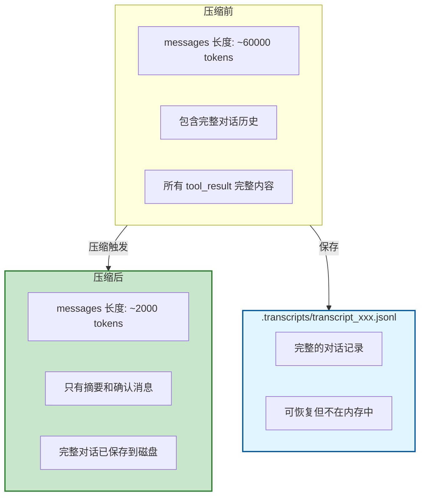
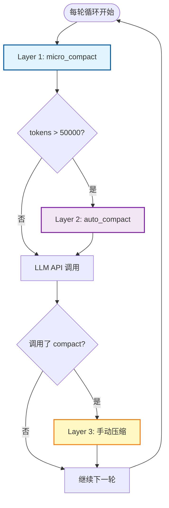
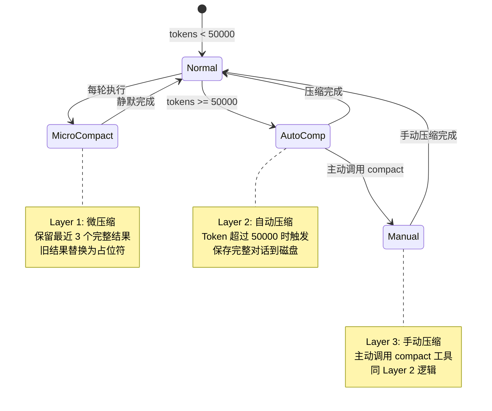

# S06 Context Compact - 上下文压缩流程图

本文档描述 `s06_context_compact.py` 的三层上下文压缩机制和执行流程。

---

## 1. 系统架构概览



---

## 2. 三层压缩策略对比



---

## 3. 微压缩流程 (micro_compact)



---

## 4. 自动压缩流程 (auto_compact)



---

## 5. 代理主循环流程（集成三层压缩）



---

## 6. 上下文压缩前后对比



---

## 7. 压缩决策流程图



---

## 8. 数据结构

### tool_result 清理前
```python
{
    "type": "tool_result",
    "tool_use_id": "toolu_001",
    "content": "完整的命令输出（可能很长）"
}
```

### tool_result 清理后
```python
{
    "type": "tool_result",
    "tool_use_id": "toolu_001",
    "content": "[Previous: used bash]"
}
```

### 压缩后的消息结构
```python
[
    {
        "role": "user",
        "content": "[Conversation compressed. Transcript: .transcripts/transcript_xxx.jsonl]\n\n# 摘要内容..."
    },
    {
        "role": "assistant",
        "content": "Understood. I have the context from the summary. Continuing."
    }
]
```

---

## 9. 状态转换图



---

## 10. 三层压缩特性总结

| 层级 | 触发条件 | 执行频率 | Token 节省 |
|------|----------|----------|------------|
| **Layer 1: micro_compact** | 每轮自动执行 | 每轮 | ~几千 tokens |
| **Layer 2: auto_compact** | Token 超过阈值 | 按需 | ~几万 tokens |
| **Layer 3: compact 工具** | 手动调用 | 按需 | ~几万 tokens |

---

## 11. 关键特性总结

| 特性 | 说明 |
|------|------|
| **渐进式压缩** | 从小幅清理到全面摘要 |
| **可恢复性** | 完整对话保存到磁盘 |
| **透明性** | 摘要保留关键信息 |
| **主动性** | 代理可以主动触发压缩 |
| **Token 估算** | 约 4 字符 = 1 token |

---

## 12. 核心洞察

> **"The agent can forget strategically and keep working forever."**
>
> 代理可以战略性遗忘并无限期工作。
