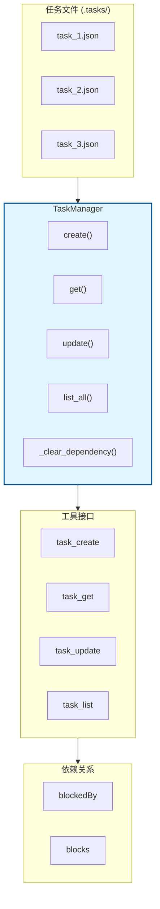
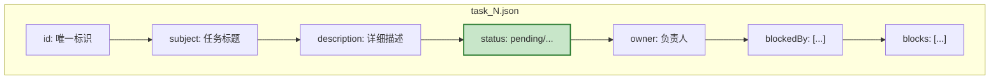
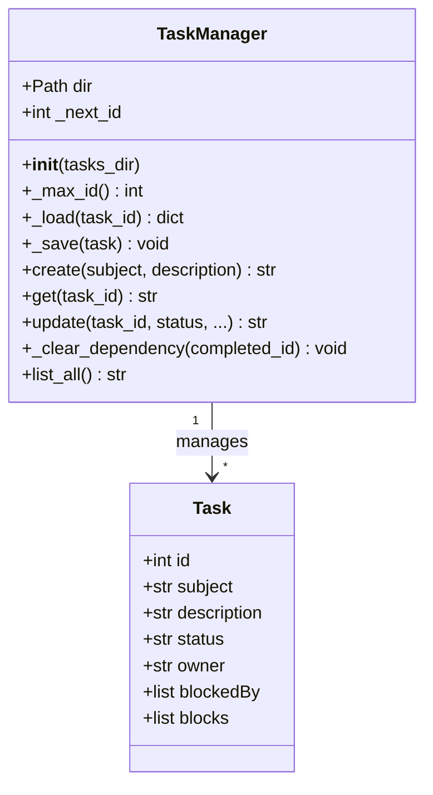
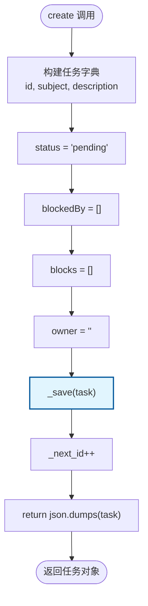
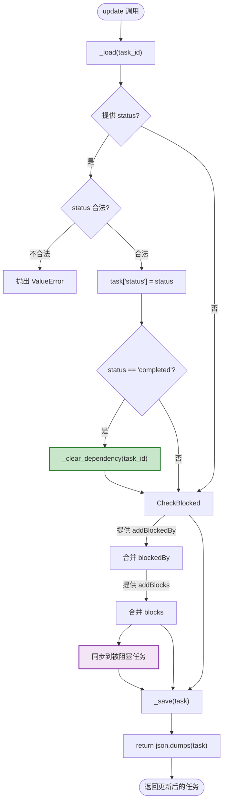
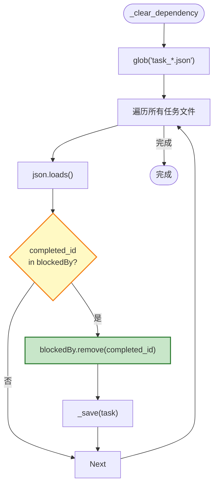
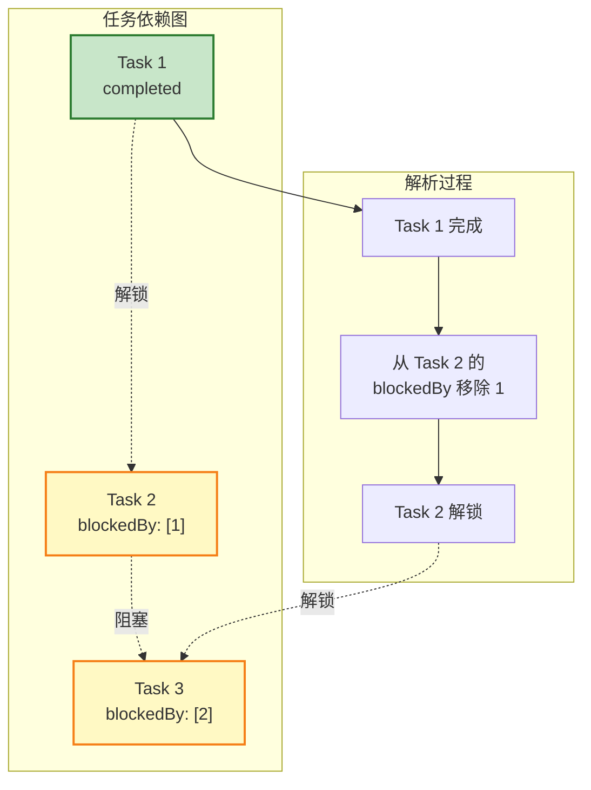
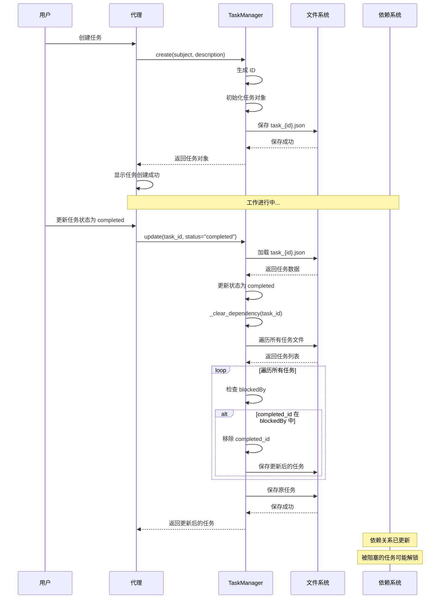
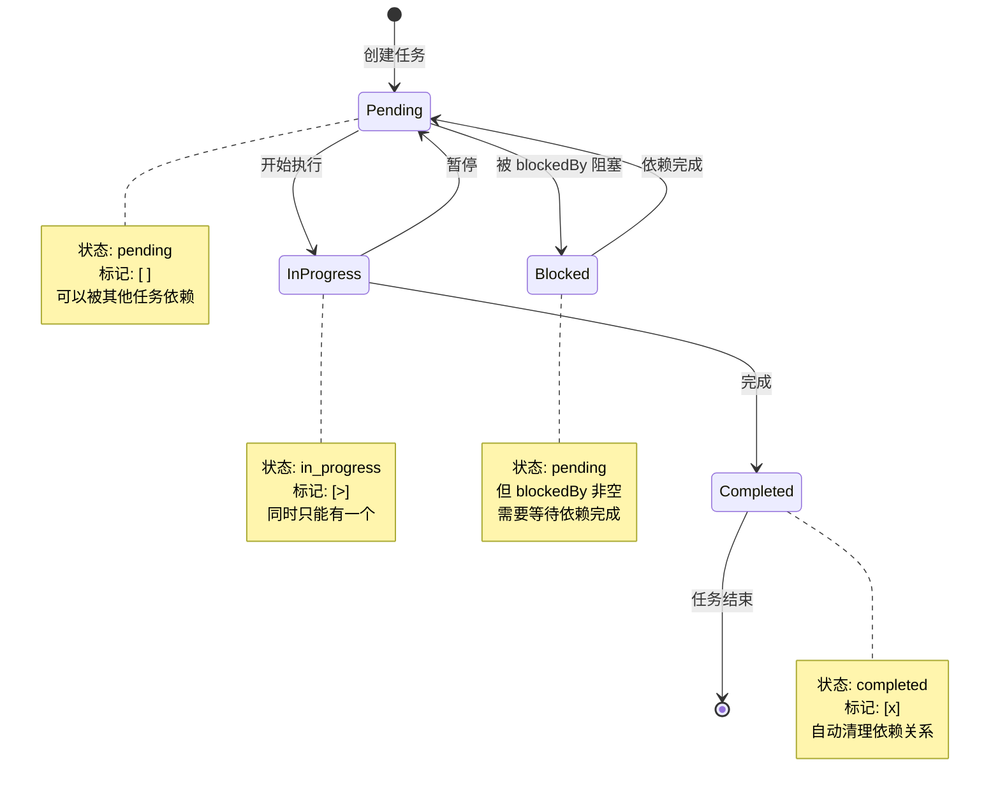

# S07 Task System - 任务系统流程图

本文档描述 `s07_task_system.py` 的持久化任务管理机制和执行流程。

---

## 1. 系统架构概览



---

## 2. 任务数据结构



---

## 3. TaskManager 类结构



---

## 4. 任务创建流程 (create)



---

## 5. 任务更新流程 (update)



---

## 6. 依赖清理流程 (_clear_dependency)



---

## 7. 依赖关系解析示例



---

## 8. 完整时序图



---

## 9. 状态转换图



---

## 10. 数据结构示例

### task_1.json (已完成的任务)
```json
{
  "id": 1,
  "subject": "实现登录功能",
  "description": "添加用户认证接口",
  "status": "completed",
  "owner": "",
  "blockedBy": [],
  "blocks": [2, 3]
}
```

### task_2.json (被阻塞的任务)
```json
{
  "id": 2,
  "subject": "实现注册功能",
  "description": "添加用户注册接口",
  "status": "pending",
  "owner": "",
  "blockedBy": [1],
  "blocks": [3]
}
```

### task_3.json (最终任务)
```json
{
  "id": 3,
  "subject": "编写用户文档",
  "description": "为登录和注册功能编写文档",
  "status": "pending",
  "owner": "",
  "blockedBy": [1, 2],
  "blocks": []
}
```

---

## 11. 关键特性总结

| 特性 | 说明 |
|------|------|
| **持久化存储** | 任务保存在 .tasks/ 目录的 JSON 文件中 |
| **依赖关系图** | 通过 blockedBy/blocks 字段管理任务依赖 |
| **状态管理** | pending → in_progress → completed |
| **上下文无关** | 任务状态独立于对话历史，压缩后仍可访问 |
| **自动解析** | 完成任务自动清理依赖关系 |
| **双向同步** | 添加 blocks 时自动更新被阻塞任务的 blockedBy |

---

## 12. 核心洞察

> **"State that survives compression -- because it's outside the conversation."**
>
> 持久化状态在压缩后仍然保留——因为它在对话之外。
