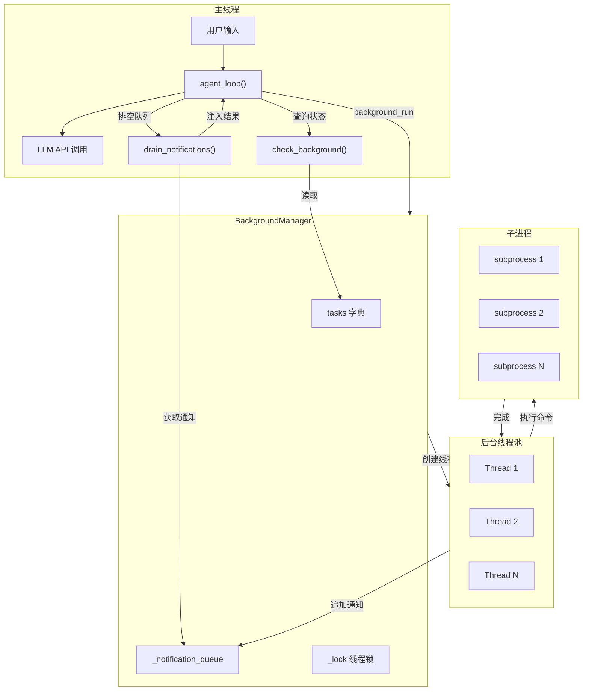
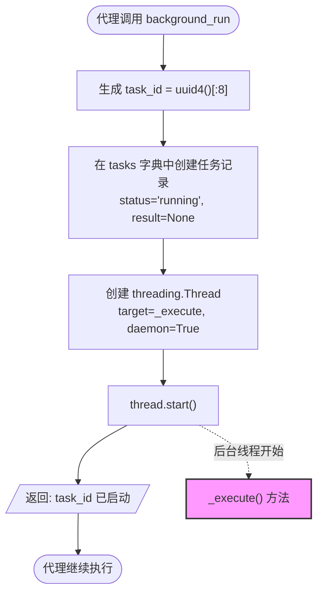
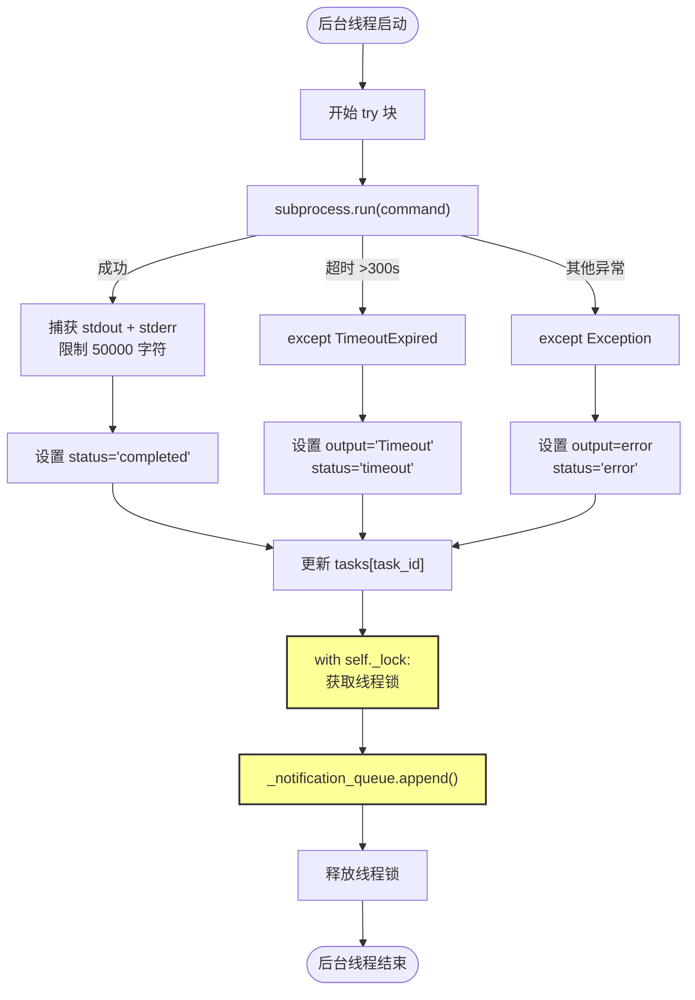
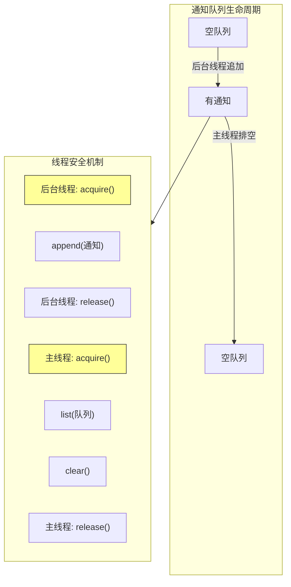
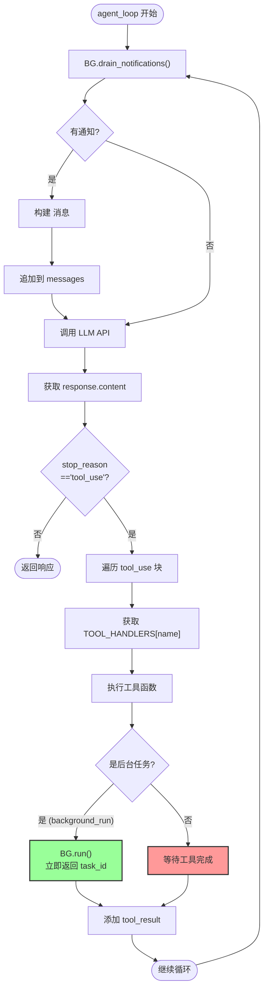
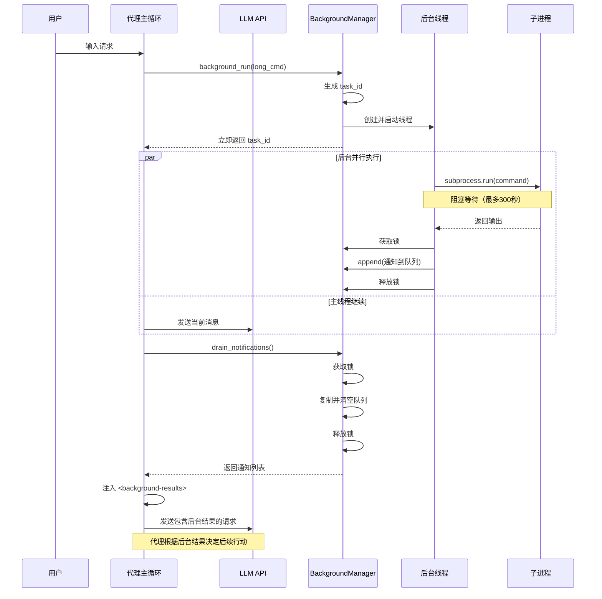
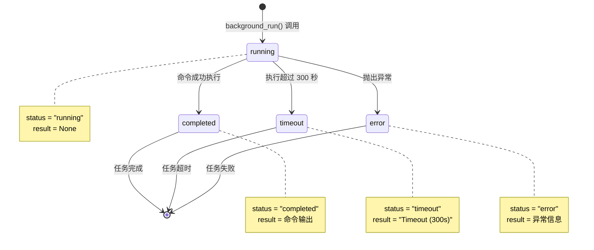

# S08 Background Tasks - 执行流程图

本文档描述 `s08_background_tasks.py` 的完整执行流程。

---

## 1. 系统架构概览



---

## 2. 后台任务启动流程 (run 方法)



---

## 3. 后台任务执行流程 (_execute 方法)



---

## 4. 通知队列处理流程



---

## 5. 代理主循环流程 (agent_loop)



---

## 6. 完整时序图



---

## 7. 状态转换图



---

## 8. 并发场景示例

```mermaid
gantt
    title 后台任务与主线程并行执行示例
    dateFormat X
    axisFormat %L

    section 主线程
    启动任务A      :a1, 0, 1
    启动任务B      :a2, 1, 1
    其他工作       :main, 2, 8
    注入结果A      :injA, 8, 1
    注入结果B      :injB, 9, 1
    LLM 调用       :llm, 10, 2

    section 后台线程A
    执行命令A      :bgA, 1, 6
    推送通知A      :notA, 7, 1

    section 后台线程B
    执行命令B      :bgB, 2, 8
    推送通知B      :notB, 10, 1
```



---

## 9. 数据结构

### tasks 字典结构
```python
tasks = {
    "a1b2c3d4": {
        "status": "completed",      # running | completed | timeout | error
        "result": "命令输出内容",    # 最多 50000 字符
        "command": "python script.py" # 原始命令
    },
    "e5f6g7h8": {
        "status": "running",
        "result": None,
        "command": "npm install"
    }
}
```

### 通知对象结构
```python
notification = {
    "task_id": "a1b2c3d4",
    "status": "completed",
    "command": "python script.py",   # 前 80 字符
    "result": "输出内容"              # 前 500 字符
}
```

---

## 10. 关键特性总结

| 特性 | 说明 |
|------|------|
| **非阻塞** | `run()` 立即返回 task_id，不等待命令完成 |
| **并行** | 多个任务可在不同线程中同时执行 |
| **状态跟踪** | `check()` 可查询任务状态 |
| **通知注入** | 完成的任务结果自动注入到对话 |
| **线程安全** | 使用 `threading.Lock` 保护共享队列 |
| **超时保护** | 命令执行最多 300 秒 |
| **守护线程** | 主程序退出时后台线程自动终止 |
