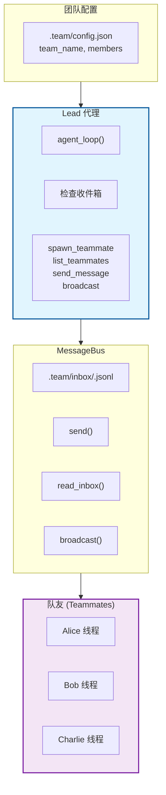
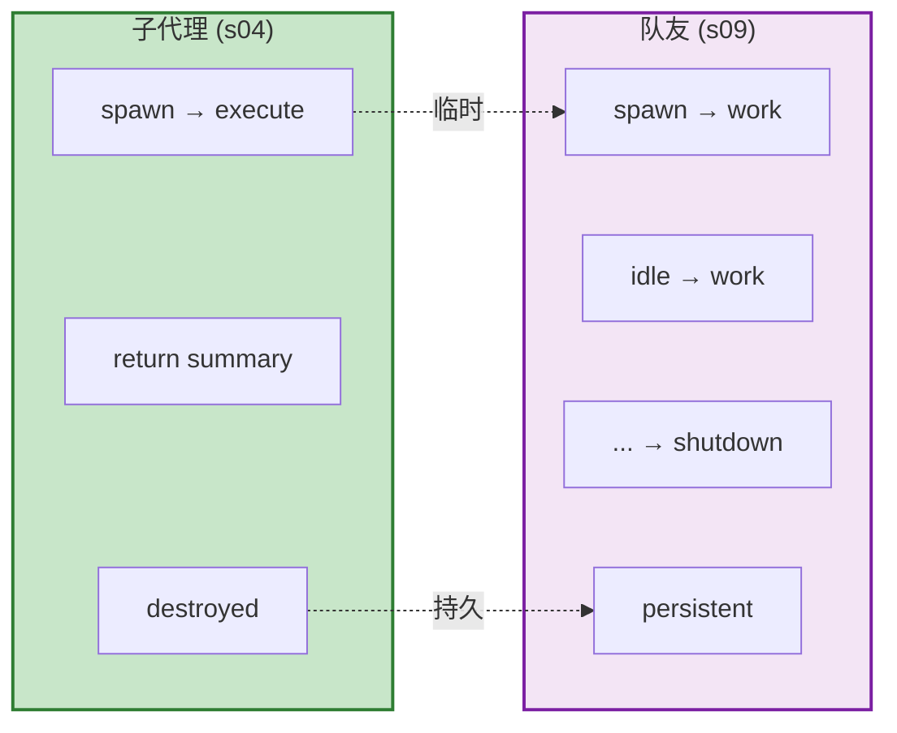
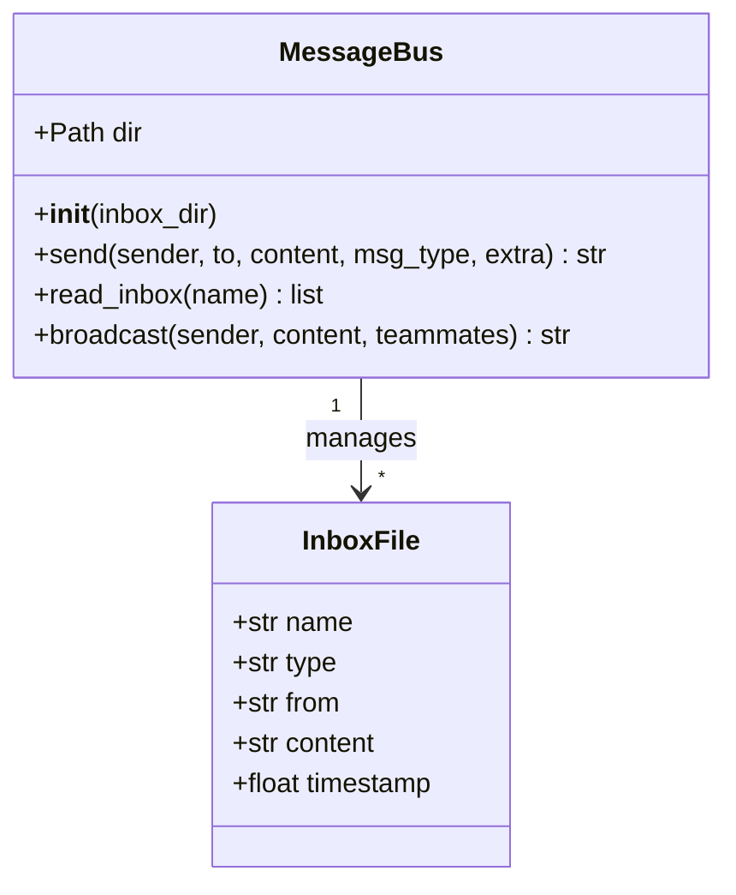
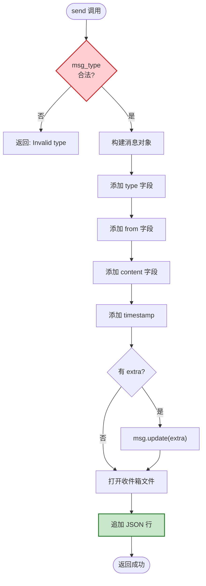
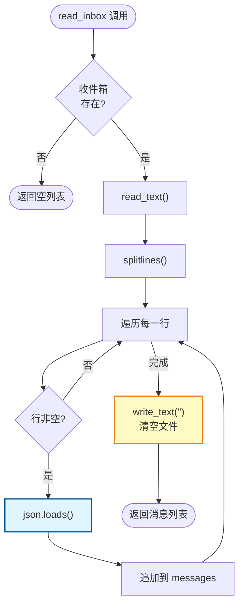
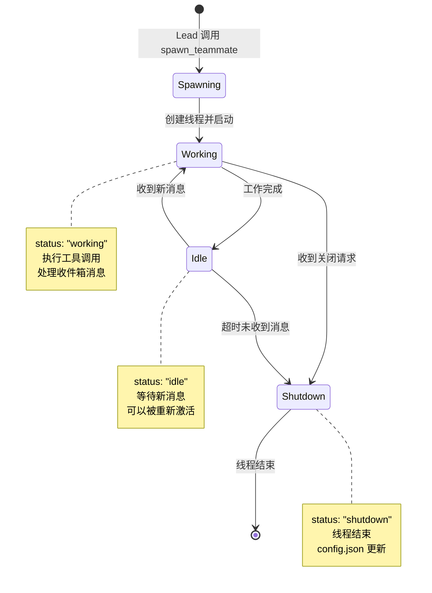
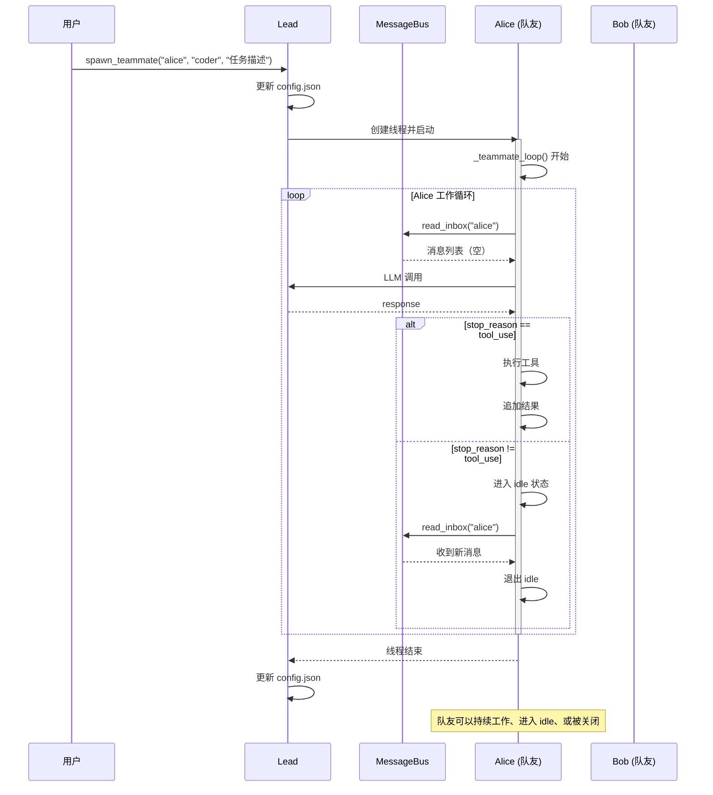
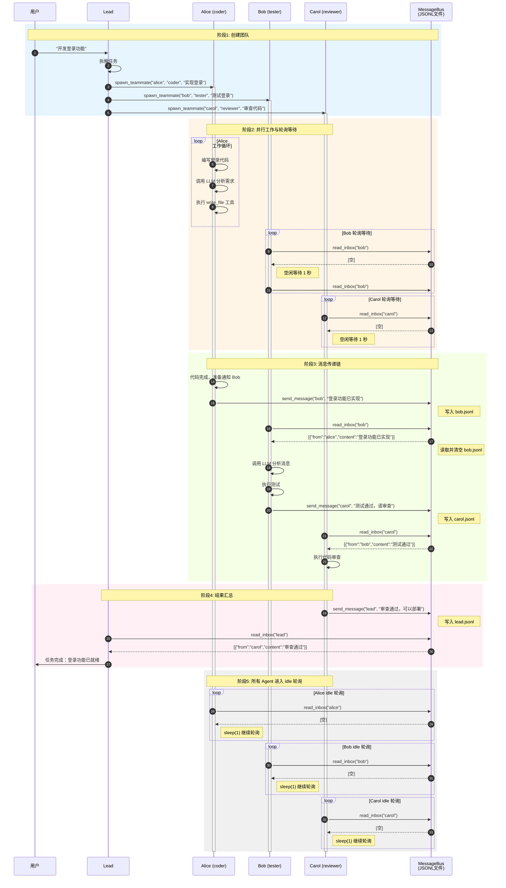
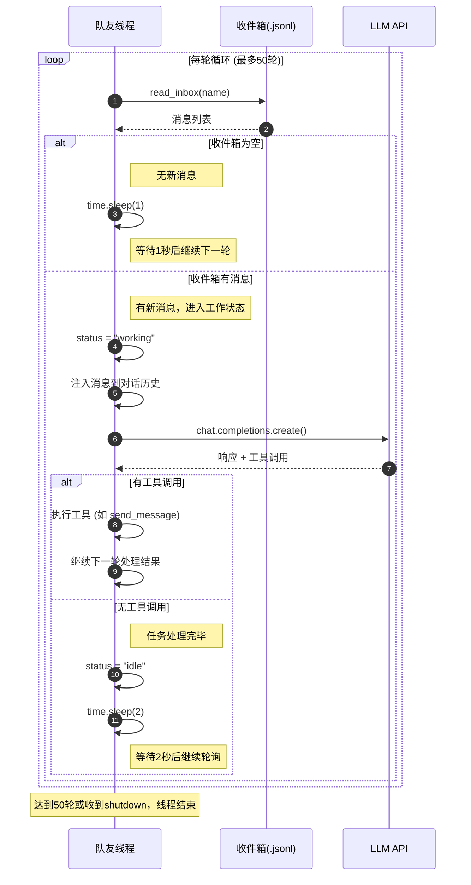
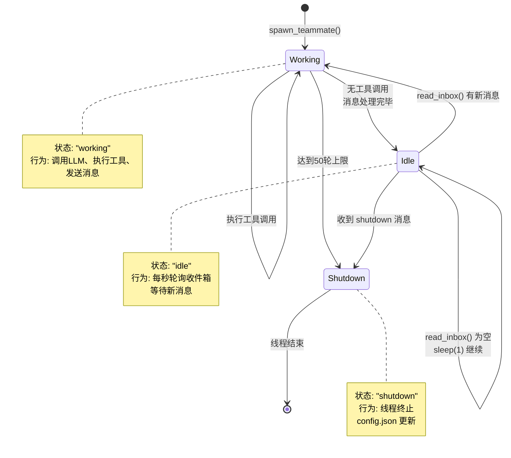

# S09 Agent Teams - 代理团队流程图

本文档描述 `s09_agent_teams.py` 的持久化队友机制和团队通信流程。

---

## 1. 系统架构概览



---

## 2. 子代理 vs 队友对比



---

## 3. MessageBus 类结构



---

## 4. 消息发送流程 (send)



---

## 5. 收件箱读取流程 (read_inbox)



---

## 6. 队友生命周期



---

## 7. 完整时序图



---

## 8. 数据结构

### .team/config.json 结构
```json
{
  "team_name": "default",
  "members": [
    {
      "name": "alice",
      "role": "coder",
      "status": "idle"
    },
    {
      "name": "bob",
      "role": "reviewer",
      "status": "working"
    }
  ]
}
```

### 收件箱消息结构
```json
{
  "type": "message",
  "from": "lead",
  "content": "消息内容",
  "timestamp": 1678901234.567
}
```

### 消息类型枚举
```python
VALID_MSG_TYPES = {
    "message",
    "broadcast",
    "shutdown_request",      # s10 实现
    "shutdown_response",     # s10 实现
    "plan_approval_response" # s10 实现
}
```

---

## 9. 关键特性总结

|| 特性 | 说明 |
||------|------|
|| **持久化** | 队友状态保存在 config.json |
|| **并行** | 每个队友在独立线程中运行 |
|| **异步通信** | 通过收件箱解耦 |
|| **生命周期** | spawn → working → idle → ... → shutdown |

---

## 10. 核心洞察

> **"Teammates that can talk to each other."**
>
> 可以相互交谈的队友。

---

## 11. 宏观架构理解

### 整体架构图

```
┌─────────────────────────────────────────────────────────────┐
│                    Agent Teams 架构                          │
├─────────────────────────────────────────────────────────────┤
│                                                             │
│   用户任务: "开发一个用户认证系统"                            │
│                         │                                   │
│                         ▼                                   │
│   ┌─────────────────────────────────────────────────────┐   │
│   │              Lead Agent (协调者)                     │   │
│   │  - 拆解任务                                          │   │
│   │  - 分配给队友                                        │   │
│   │  - 汇总结果                                          │   │
│   └──────────────────┬──────────────────────────────────┘   │
│                      │                                      │
│          ┌──────────┼──────────┐                           │
│          ▼          ▼          ▼                           │
│   ┌──────────┐ ┌──────────┐ ┌──────────┐                  │
│   │  Alice   │ │   Bob    │ │  Carol   │                  │
│   │  coder   │ │  tester  │ │ reviewer │                  │
│   │          │ │          │ │          │                  │
│   │ 写代码   │ │ 写测试   │ │ 代码审查 │                  │
│   └────┬─────┘ └────┬─────┘ └────┬─────┘                  │
│        │            │            │                         │
│        └────────────┼────────────┘                         │
│                     ▼                                      │
│   ┌─────────────────────────────────────────────────────┐  │
│   │            Message Bus (JSONL 收件箱)               │  │
│   │                                                     │  │
│   │  alice.jsonl  ←── Bob 发送: "代码已测，请 review"   │  │
│   │  bob.jsonl    ←── Alice 发送: "功能已实现"          │  │
│   │  carol.jsonl  ←── Alice 发送: "请审查 PR #123"      │  │
│   └─────────────────────────────────────────────────────┘  │
│                                                             │
└─────────────────────────────────────────────────────────────┘
```

### 与其他模式对比

|| 模式 | 生命周期 | 通信方式 | 适用场景 |
||------|----------|----------|----------|
|| **Subagent (s04)** | 临时，执行完销毁 | 单向返回结果 | 子任务委托 |
|| **Background Task (s08)** | 后台运行，超时结束 | 通知队列 | 长时间命令 |
|| **Teammate (s09)** | 持久化，反复工作 | 双向消息传递 | 团队协作 |

```
Subagent (s04):     spawn → execute → return → destroyed
                                          (单向，一次)

Background (s08):   spawn → run → timeout/complete
                               ↓
                        notification queue

Teammate (s09):     spawn → work → idle → work → ... → shutdown
                                    ↑________↓
                                    (双向，持续)
```

---

## 12. 通信机制详解

### 核心难点：Agent 间通信

Agent Teams 的核心挑战是如何让多个独立运行的 Agent 之间可靠地通信。

### 解决方案：JSONL 文件收件箱

```
.team/inbox/
├── alice.jsonl   # Alice 的收件箱
├── bob.jsonl     # Bob 的收件箱
└── lead.jsonl    # Lead 的收件箱
```

### 消息格式

```json
{
  "type": "message",           # 消息类型
  "from": "alice",             # 发送者
  "to": "bob",                 # 接收者
  "content": "代码完成了，请测试",
  "timestamp": 1773727965.123
}
```

### Drain 模式读取（关键设计）

```python
def read_inbox(name):
    """
    读取并清空收件箱（Drain 模式）
    
    关键点：
    1. 读取所有消息
    2. 清空文件
    3. 返回消息列表
    
    这样确保消息不会被重复处理
    """
    messages = [json.loads(l) for l in file.readlines()]
    file.truncate(0)  # 清空文件
    return messages
```

### 为什么用 JSONL 文件？

|| 方案 | 优点 | 缺点 |
||------|------|------|
|| **内存队列** | 快速 | 进程重启丢失 |
|| **数据库** | 可靠 | 复杂，需要额外依赖 |
|| **JSONL 文件** | 简单、持久化、可调试 | 并发写入需注意 |

JSONL 的优势：
1. **可持久化** - 进程重启不丢失消息
2. **可调试** - 可以直接查看文件内容
3. **简单** - 无需额外依赖
4. **追加写入** - 天然支持消息队列

---

## 13. 核心价值

### 单 Agent vs Agent Teams

```
单 Agent 模式:
┌─────────────────────────────────────┐
│            一个大脑                  │
│  ┌─────────────────────────────┐    │
│  │ 处理所有任务                 │    │
│  │ - 需求分析                  │    │
│  │ - 编码                      │    │
│  │ - 测试                      │    │
│  │ - 部署                      │    │
│  └─────────────────────────────┘    │
└─────────────────────────────────────┘
问题：容易出错、效率低、难以并行

Agent Teams 模式:
┌─────────────────────────────────────┐
│           多个专业大脑               │
│  ┌─────────┐ ┌─────────┐ ┌────────┐ │
│  │  Alice  │ │   Bob   │ │ Carol  │ │
│  │  专注   │ │  专注   │ │ 专注   │ │
│  │  编码   │ │  测试   │ │ 审查   │ │
│  └─────────┘ └─────────┘ └────────┘ │
│       ↓           ↓          ↓      │
│      ─────────────────────────      │
│               消息总线              │
└─────────────────────────────────────┘
优势：专业分工、并行执行、互相协作
```

### 本质

> **用架构解决复杂度**
>
> 将大任务拆分，让专业 Agent 并行处理，通过消息总线协调。

---

## 14. 实践建议

### 何时使用 Agent Teams

1. **任务可拆分** - 大任务可以分解为独立子任务
2. **需要并行** - 多个子任务可以同时进行
3. **专业分工** - 不同子任务需要不同专业技能
4. **需要协作** - Agent 之间需要通信协调

### 示例场景

|| 场景 | 队友角色 | 协作方式 |
||------|----------|----------|
|| 软件开发 | coder, tester, reviewer | coder→tester→reviewer |
|| 数据分析 | collector, analyzer, visualizer | collector→analyzer→visualizer |
|| 内容创作 | researcher, writer, editor | researcher→writer→editor |
|| 客服系统 | triage, specialist, followup | triage→specialist→followup |

---

## 15. 消息流转完整流程

### 15.1 文件流转机制

```
.team/inbox/ 目录结构：

alice.jsonl  ←─── 其他人发送给 Alice 的消息
bob.jsonl    ←─── 其他人发送给 Bob 的消息
carol.jsonl  ←─── 其他人发送给 Carol 的消息
lead.jsonl   ←─── 其他人发送给 Lead 的消息

消息写入：追加模式 (append)
消息读取：Drain 模式 (读取后清空)
```

### 15.2 完整时序图：从任务开始到结束



### 15.3 轮询机制详解



### 15.4 消息写入与读取流程

```mermaid
flowchart TB
    subgraph 发送方["发送方 (Alice)"]
        A1["send_message(to='bob', content='...')"]
        A2["构建消息对象<br/>{type, from, content, timestamp}"]
        A3["打开 bob.jsonl<br/>追加写入 JSON 行"]
    end

    subgraph 文件["JSONL 文件"]
        F1["bob.jsonl"]
        F2["{\"from\":\"alice\",<br/>\"content\":\"...\",<br/>\"timestamp\":...}"]
    end

    subgraph 接收方["接收方 (Bob)"]
        B1["read_inbox('bob')"]
        B2["读取所有行<br/>解析 JSON"]
        B3["清空文件 (Drain)"]
        B4["返回消息列表"]
        B5["注入到对话历史"]
    end

    A1 --> A2 --> A3
    A3 --> F1
    F1 --> F2
    F2 --> B1
    B1 --> B2 --> B3 --> B4 --> B5

    style 发送方 fill:#e3f2fd,stroke:#1565c0
    style 文件 fill:#fff3e0,stroke:#ef6c00
    style 接收方 fill:#e8f5e9,stroke:#2e7d32
```

### 15.5 单个 Agent 状态转换



### 15.6 时间线视图

```
时间 →
──────────────────────────────────────────────────────────────────────────────

T0   用户输入任务
     │
T1   Lead 拆解任务，spawn 三个队友
     │
     ├──► Alice 线程启动 ──► [工作: 编码] ──► [完成] ──► send_message(bob) ──► [idle/轮询]
     │                                                        │
T2   │                                                        ▼ 写入
     │                                              bob.jsonl: [{from:alice, ...}]
     │                                                        │
     ├──► Bob 线程启动 ──► [idle/轮询] ──► [idle/轮询] ──► [读取消息] ──► [工作: 测试]
     │                                                        │
T3   │                                                        ▼
     │                                                    [完成] ──► send_message(carol)
     │                                                                  │
T4   │                                                                  ▼ 写入
     │                                                        carol.jsonl: [{from:bob, ...}]
     │                                                                  │
     ├──► Carol 线程启动 ──► [idle/轮询] ──► [idle/轮询] ──► [读取消息] ──► [工作: 审查]
     │                                                                  │
T5   │                                                                  ▼
     │                                                    [完成] ──► send_message(lead)
     │                                                                  │
T6   │                                                                  ▼
     │                                                        lead.jsonl: [{from:carol, ...}]
     │                                                                  │
     └──► Lead 读取消息 ◄───────────────────────────────────────────────┘
              │
T7           ▼
        汇总结果，通知用户

T8   所有 Agent 进入 idle 轮询状态，等待新任务...
     Alice: [check]→空→sleep→[check]→空→sleep→...
     Bob:   [check]→空→sleep→[check]→空→sleep→...
     Carol: [check]→空→sleep→[check]→空→sleep→...
```

### 15.7 关键参数说明

| 参数 | 值 | 说明 |
|------|-----|------|
| 最大循环轮数 | 50 | 防止无限循环，每个 Agent 最多执行 50 轮 |
| 空闲轮询间隔 | 1秒 | 收件箱为空时，等待 1 秒后继续检查 |
| 忙碌后间隔 | 2秒 | 处理完消息无工具调用时，等待 2 秒后继续 |
| 最大 Token | 8000 | LLM 响应的最大 token 数 |

### 15.8 Drain 模式保证

```python
# read_inbox 的原子性操作

def read_inbox(name):
    """
    Drain 模式：读取后立即清空

    保证：
    1. 消息只被处理一次
    2. 不会丢失消息（先读后清）
    3. 线程安全（单线程处理单个收件箱）
    """
    # Step 1: 读取所有消息
    messages = []
    with open(inbox_file, "r") as f:
        for line in f:
            messages.append(json.loads(line))

    # Step 2: 清空文件
    with open(inbox_file, "w") as f:
        pass  # truncate to 0

    # Step 3: 返回消息
    return messages
```

**要点：**
- 同一时刻只有一个线程读取特定收件箱（每个 Agent 只读取自己的收件箱）
- 读取和清空是连续操作，不会被中断
- 消息不会重复处理，也不会丢失
