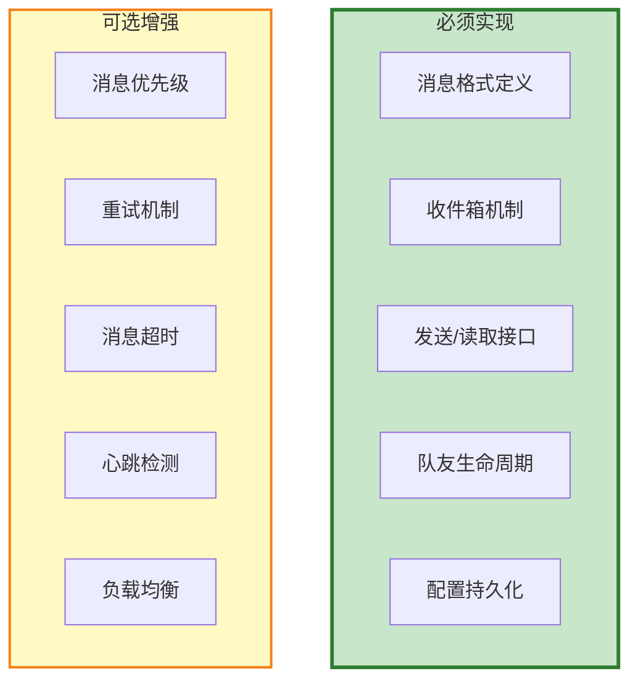
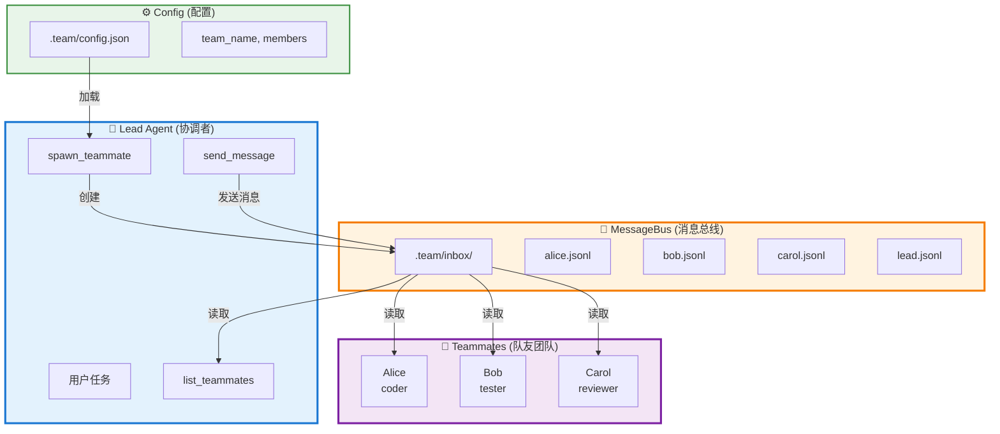
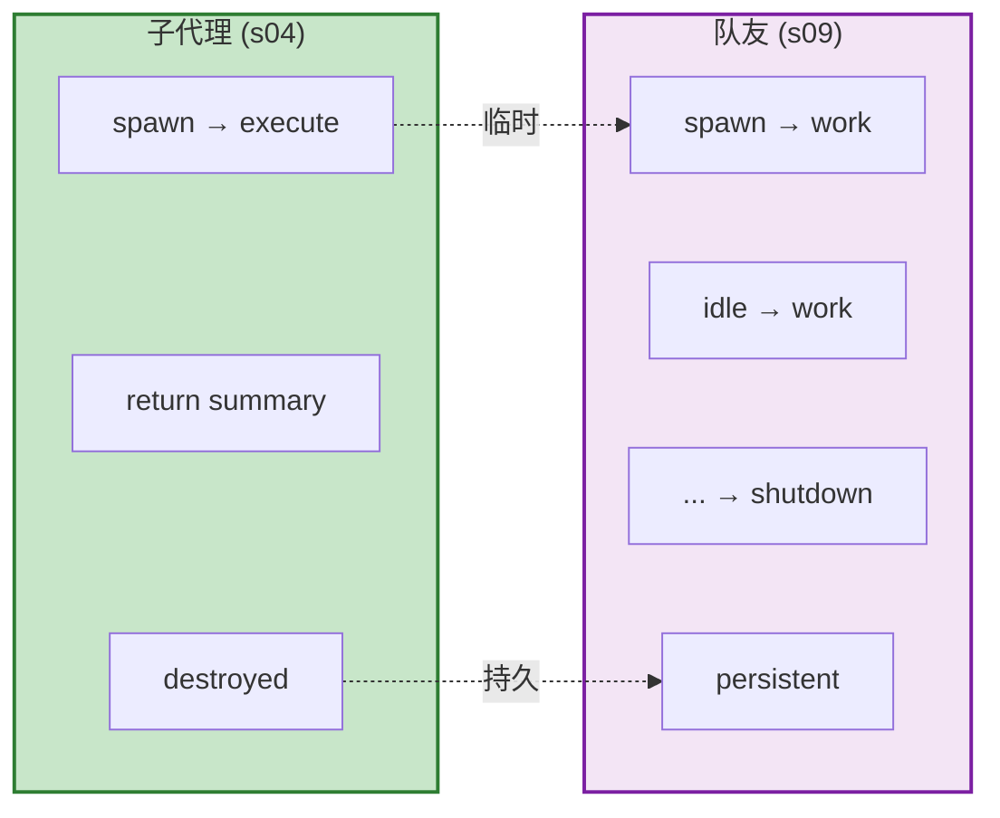
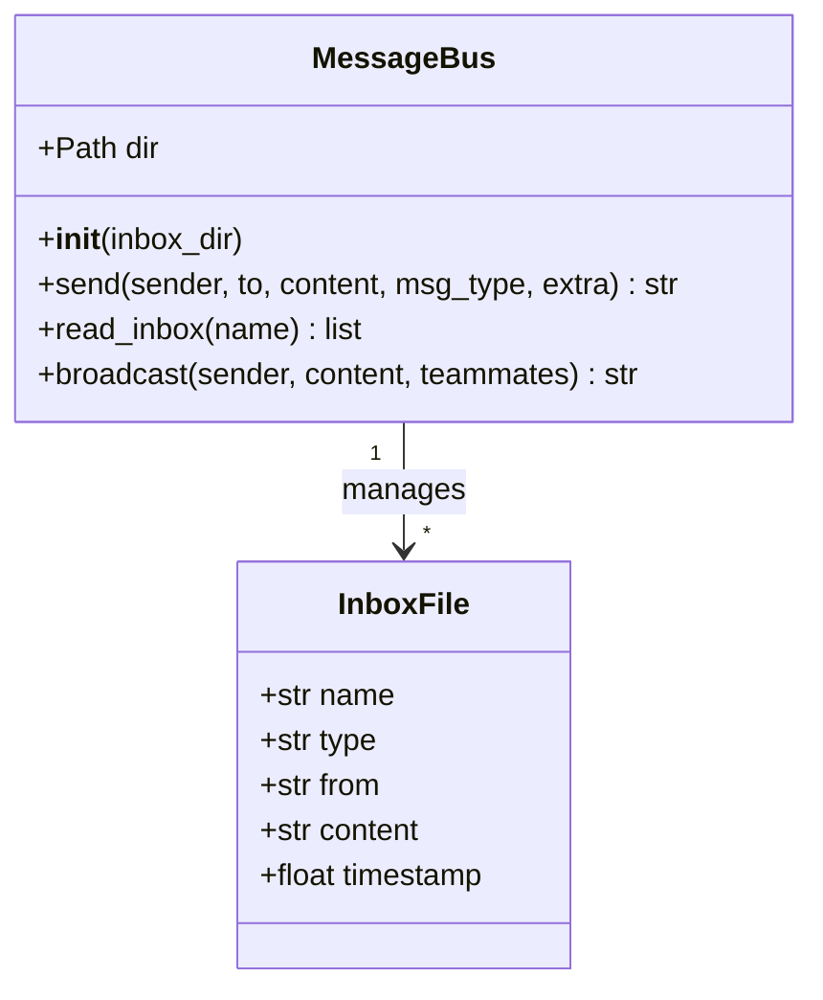
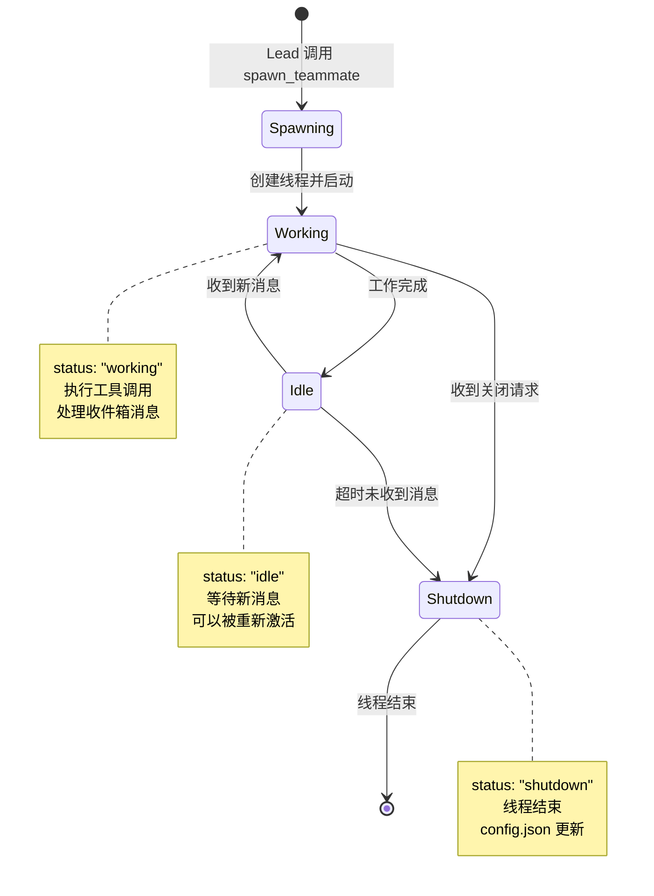
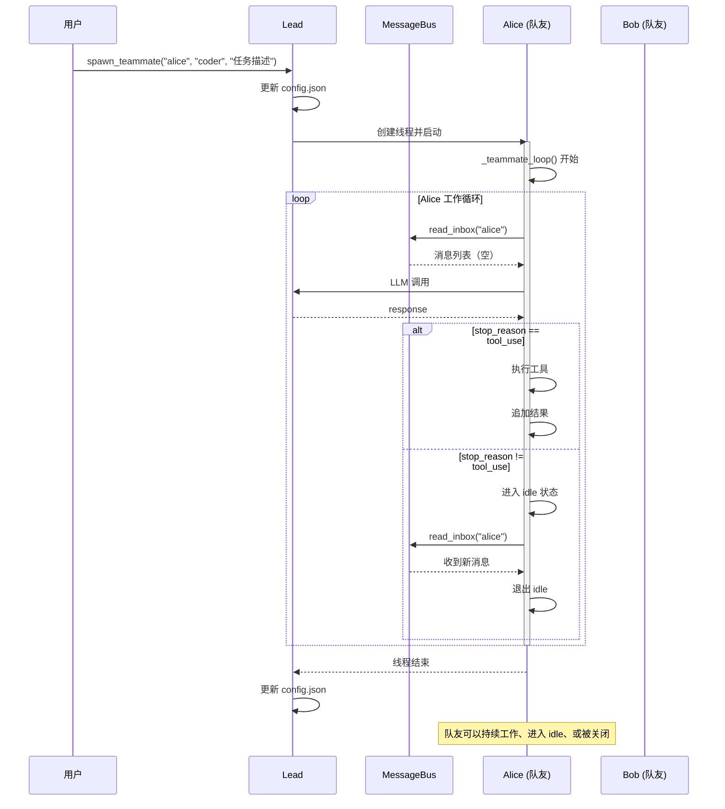
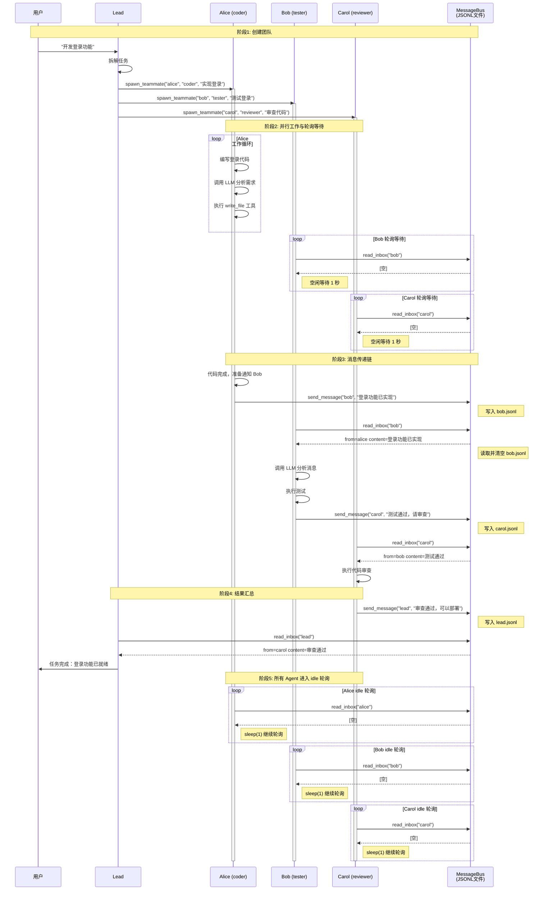
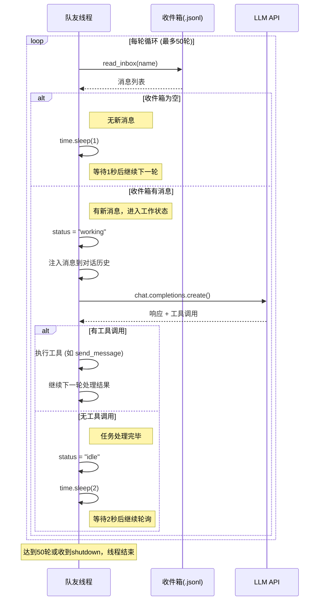
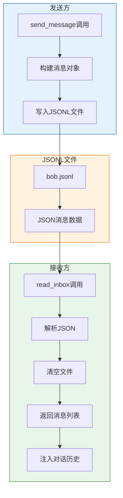
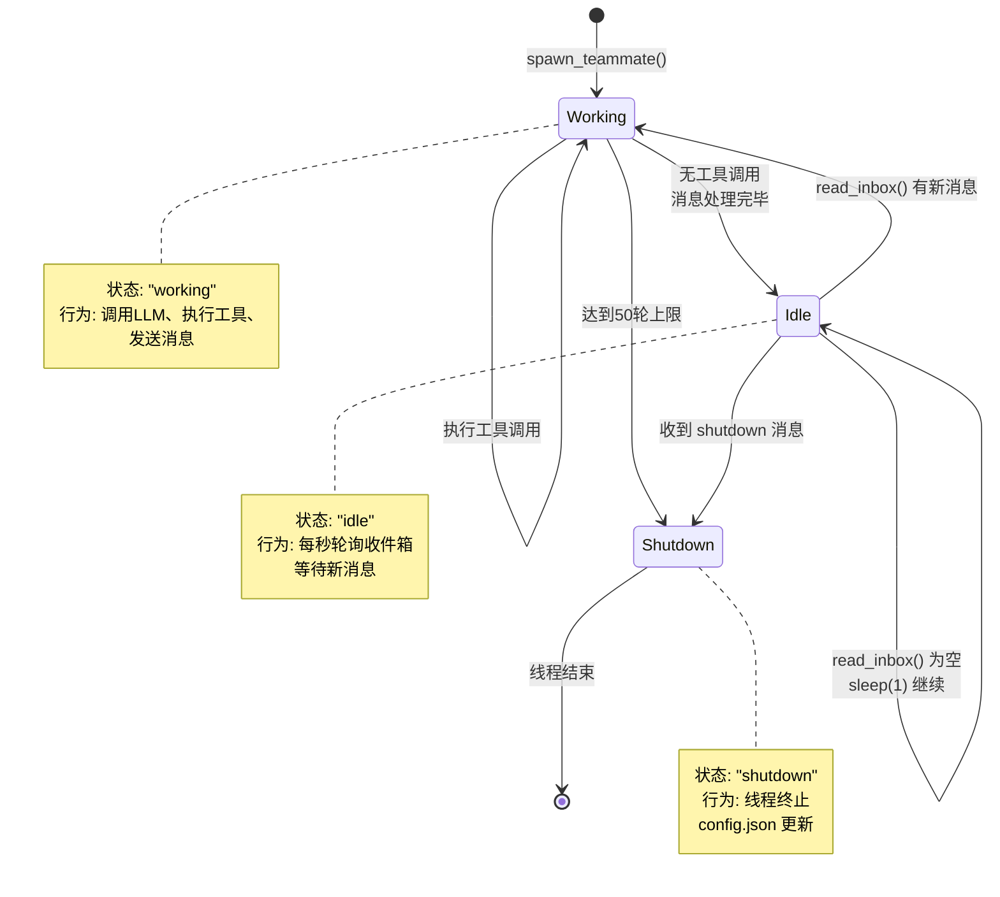

# S09 Agent Teams - 代理团队流程图

agent 项目像是一个黑盒，工具调用等都是黑盒。很难100%复测项目，很多都是 ai 来决策，然后执行，不确定性很大，因此也需要很多兜底处理。

"在teammate的独立线程中执行的脚本是通过 _teammate_loop 来执行命令，执行的命令是调用大模型，大模型使用的工具是 teammate_tools的单独的工具，循环50次，先读取当前线程对应的角色对应的 .jsonl 文件，查看消息，如果有消息则添加到当前teamate的message 中，通用当模型返回没有工具调用时，break,进入下一次循环，如果有工具，则调用工具，把工具调用结果放入上下文，模型可能调用bash 工具，来执行命令，读取文件，或者获取文件夹信息等操作，_exec 是模型返回调用什么工具则执行对应的工具ag/s09_agent_teams.py:192 是将调用工具的结果打印到控制台，然后将输出放入上下文中，进入下一次循环。
多agent 的形式，也就是这里多成员的形式，比如两种角色，coder 和tester,coder完成任务可以send_message 给 tester，让他进行代码测试，也可以是tester 将发现的问题，通过 send_message方法把信息传给 coder,然后coder 执行修改，这两者的循环是同时在两个线程中，循环50次，结束后，读取.team/config.json，调整teammeta 的状态为 idle,然后保存配置"

messageBus 是一个简单的基于jsonl 文件的异步通信方案，通过在INBOX_DIR 中定义每个teammate 的信箱实现通信，方法有：send 发送消息，read_inbox 读取信箱，broadcast 广播，一次发送多次消息。其中发送消息，发送给指定teammate，通过只追加写入对方的 .jsonl 文件实现。read_inbox 读取全部消息后 drain 清空消息列表，确保消息不重复处理。
在模型调用时，在提供给 teammate 发送，读取，广播消息的tools。在 teammate 每次执行循环时，首先会读取自己的信箱，把消息添加到自身的message。在teammate 调用工具时，执行对应的消息操作

TeammateManager 是队友管理器，管理持久化队友的整个生命周期，包括配置存储和线程管理，核心是通过 .team/config.json 持久化 teammate 配置 + 独立线程执行。构造函数是初始化队友管理器，创建队友管理器实例，加载或创建团队配置，包括配置的目录路径、配置文件路径、配置数据、线程字典。方法有 _load_config 加载配置文件，_save_config 保存配置文件，_find_member 查找成员，spawn 创建新线程运行代理循环，_teammate_loop 在独立线程中运行，_exec 执行工具调用（队友线程使用），_teammate_tools 获取队友可用的工具列表，list_all 列出所有队友信息，member_names 获取所有队友名称列表。

TeammateManager 是底层支撑类，lead 通过 spawn_teammate、list_teammates、broadcast 等工具接口间接使用它。TeammateManager 通过文件 read_text()、write_text() 读写配置，通过遍历查询成员。spawn 创建新队员或重新激活已存在的队友，启动独立线程执行代理循环。threading.Thread 创建新线程来执行队友的代理循环，thread.start() 在新线程中独立执行。target=self._teammate_loop 是线程目标函数，在独立线程中执行，处理消息和工具调用。队友有自己专用的系统提示词，处理消息历史、工具，然后进入循环 → 读取消息 → 调用 LLM → 处理返回 → 处理工具调用 → 将工具结果作为用户消息添加到历史。循环结束后，如果状态不是 shutdown，更新队友状态为 idle。在 teammate 中相当于有一个小型的 agent 循环。_exec 执行工具的方法，分发基础工具到对应的执行函数。_teammate_tools 获取队友可用的工具列表，通过返回自定义的工具列表限制 teammate 的能力以区分 lead 和 teammate。list_all 方便 lead 知道所有队友的状态。member_names 方便 lead 获取所有成员的名称。

本文档描述 `s09_agent_teams.py` 的持久化队友机制和团队通信流程。

---

## 0. 设计代理团队的核心考量

### 0.1 为什么需要代理团队？
> *"任务太大一个人干不完, 要能分给队友"* -- 持久化队友 + JSONL 邮箱。

真正的团队协作需要三样东西: (1) 能跨多轮对话存活的持久智能体, (2) 身份和生命周期管理, (3) 智能体之间的通信通道。

多智能体系统结构应该包含：
* 通信层，多智能体之间通信
* 管理层，管理线程及配置
* 智能体层，agent_loop(主控) + _teammate_loop(子智能体)
* 工具层，agent的基本应用工具

当前的架构是基于**文件**的通信机制（MessageBus）
每个智能体一个 jsonl 文件作为邮箱，通过追加消息和读取消息来通信
.team/inbox/
├── lead.jsonl      # 主控的邮箱
├── alice.jsonl      # 智能体A的邮箱  
├── bob.jsonl        # 智能体B的邮箱

智能体生命周期管理（TeammateManger）
``` text
.team/config.json
{
  "team_name": "default",
  "members": [
    {"name": "alice", "role": "coder", "status": "idle"},
    {"name": "bob", "role": "reviewer", "status": "working"}
  ]
}

# spawn = 创建新线程 + 更新状态
def spawn(self, name, role, prompt):
    member = {"name": name, "role": role, "status": "working"}
    self.config["members"].append(member)
    thread = threading.Thread(target=self._teammate_loop, args=(...))
    thread.start()
```
工业级的agent，会把上面几层升级
通信层-> redis stream/ RabbitMQ 
管理层-> fastapi
智能体层-> YAML 热加载
工具层-> MCP 工具

OpenClaw不仅是一个智能体，它更是一套完整的"智能体操作系统"（Agent OS） 

### 核心组件解析：

| 组件 | 功能 | 通俗理解 |
|:---|:---|:---|
| **Gateway** | 永不离线的守护进程，负责消息排队、任务分发、安全审查 | 像机场塔台，指挥所有"飞机"起降 |
| **Pi Runtime** | 思考中枢，采用"思考→行动→观察→反思"（ReAct）循环 | 像大脑，不断思考下一步做什么 |
| **Skills** | 以Markdown文件定义的可插拔能力包，社区有13,000+个 | 像App Store，随时安装新技能 |
| **Memory** | SOUL.md定义人格，MEMORY.md存储长期记忆 | 像人的性格和记忆，越用越懂你 |
| **Nodes** | 部署在手机、电脑上的执行终端，能控制屏幕、发通知 | 像手和脚，真正"动手做事" |

## 🔄 OpenClaw与你的s09代码对比

把你之前学习的s09_agent_teams.py和OpenClaw放在一起对比，会发现惊人的相似性，只是OpenClaw把每一层都做到了"工业级"：

| 层级 | 你的s09代码 | OpenClaw的工业级实现 |
|:---|:---|:---|
| **通信层** | JSONL文件inbox | Gateway + 25+通讯渠道（钉钉/飞书/Telegram等） |
| **管理层** | TeammateManager + 线程 | 独立的Gateway守护进程 + 微服务架构 |
| **智能体层** | agent_loop + _teammate_loop | Pi Runtime + ReAct循环 + 心跳机制（主动唤醒） |
| **工具层** | bash/read_file等硬编码 | Skills插件系统 + 13,000+可扩展能力 |
| **状态层** | 内存变量 | 三级存储：短期(Redis)+长期(Milvus)+结构化(Postgres) |

**最关键的区别**：你的s09代码是"被动响应"——用户发消息才动；OpenClaw是"主动工作"——有**心跳机制**，可以定时唤醒自己执行任务，这才是真正的"数字员工"。 


### 0.3 核心设计决策

#### 决策1: 通信机制

| 方案 | 优点 | 缺点 |
|------|------|------|
| 共享内存队列 | 快速 | 进程重启丢失 |
| 数据库 | 可靠、可扩展 | 复杂、依赖多 |
| **JSONL 文件** | **简单、可调试、持久化** | 并发需注意 |
| 消息中间件 | 专业、可靠 | 重、成本高 |

**S09 选择: JSONL 文件**
原因: 简单持久化 + 易调试 + 无额外依赖

#### 决策2: Agent 生命周期

| 模式 | 生命周期 | 适用场景 | 示例 |
|------|----------|----------|------|
| **临时** | spawn → execute → destroyed | 一次性任务 | 帮我写一个函数 |
| **持久化** | spawn → work → idle → ... → shutdown | 需要反复协作 | 软件开发团队 |

#### 决策3: 消息传递模式

| 模式 | 符号 | 说明 | 示例 |
|------|------|------|------|
| 单向 | 1→1 | 点对点通信 | Lead → teammate "完成任务" |
| 广播 | 1→N | 一对多通知 | Lead → *teammates "所有人暂停" |
| 双向 | 1↔1 | 请求响应 | teammate ↔ Lead "汇报进度" |
| 多向 | N↔N | 自由协作 | teammate ↔ teammate "协作完成" |

**S09 支持: 全部四种模式**

#### 决策4: 并发模型

| 模型 | 实现 | 适用场景 | S09选择 |
|------|------|----------|---------|
| 多进程 | multiprocessing | CPU 密集型 | ❌ |
| **多线程** | **threading** | **I/O 密集型** | **✅** |
| 异步协程 | asyncio | 高并发轻量级 | ❌ |

**S09 选择: threading**
原因: LLM 调用是 I/O 密集型，Python GIL 不影响

### 0.4 必须设计的核心组件



#### 组件1: 消息格式
```python
# 最小可行格式
{
    "type": "message",           # 消息类型
    "from": "alice",             # 发送者
    "to": "bob",                 # 接收者
    "content": "任务完成",       # 内容
    "timestamp": 1234567890.123  # 时间戳
}

# 可选扩展字段
{
    "priority": "high",          # 优先级
    "reply_to": "msg_id_123",    # 回复引用
    "metadata": {...}            # 元数据
}
```

#### 组件2: 收件箱机制
```python
# Drain 模式 - 读取即清空
def read_inbox(name):
    # 1. 读取所有消息
    messages = load_messages(f"{name}.jsonl")
    # 2. 清空文件
    clear_file(f"{name}.jsonl")
    # 3. 返回消息
    return messages

# 优点: 不会重复处理
# 注意: 需保证原子性
```

#### 组件3: 队友生命周期
```python
状态流转:
spawning → working → idle → working → ... → shutdown

# 关键点
- working: 正在处理任务
- idle: 等待新消息 (轮询)
- shutdown: 清理资源、保存状态
```

#### 组件4: 配置持久化
```json
{
    "team_name": "default",
    "members": [
        {"name": "alice", "role": "coder", "status": "idle"},
        {"name": "bob", "role": "tester", "status": "working"}
    ]
}

# 用途
- 进程重启后恢复团队
- 追踪队友状态
- 防止重复创建
```

### 0.5 常见陷阱与避免

| 陷阱 | 症状 | 解决方案 |
|------|------|----------|
| **消息丢失** | Agent 收不到消息 | 使用 Drain 模式 + 原子写入 |
| **死锁** | Agent 相互等待 | 设置超时 + 心跳检测 |
| **内存泄漏** | 长时间运行内存增长 | 限制对话历史长度 |
| **重复创建** | 同名队友多个实例 | 启动前检查 config.json |
| **资源泄漏** | 线程未正确退出 | 实现 graceful shutdown |
| **竞争条件** | 多个 Agent 同时写入 | 每个Agent独立收件箱 |

### 0.6 设计检查清单

开始实现前，确认：

- [ ] 任务确实需要多 Agent 协作？
- [ ] 明确了每个 Agent 的角色职责？
- [ ] 定义了清晰的消息格式？
- [ ] 选择了合适的通信机制？
- [ ] 设计了 Agent 生命周期管理？
- [ ] 考虑了错误处理和恢复？
- [ ] 规划了配置持久化？
- [ ] 设置了合理的超时和重试？
- [ ] 实现了优雅关闭机制？
- [ ] 准备了调试和监控手段？

### 0.7 快速决策树

```
需要设计代理团队？
│
├─ 任务可以拆分？ ──NO──→ 使用单 Agent 或 Subagent
│
├─YES─ 子任务需要通信？
│         │
│         ├─NO──→ 使用 Background Task (s08)
│         │
│         └─YES─ 需要持久化队友？
│                   │
│                   ├─NO──→ 使用临时 Subagent (s04)
│                   │
│                   └─YES──→ 🎯 使用 Agent Teams (s09)
│
最终选择: Agent Teams
```

---

## 1. 系统架构概览



---

## 2. 子代理 vs 队友对比



---

## 3. MessageBus 类结构



---

## 4. 消息发送流程 (send)


---

## 5. 收件箱读取流程 (read_inbox)


---

## 6. 队友生命周期



---

## 7. 完整时序图



---

## 8. 数据结构

### .team/config.json 结构
```json
{
  "team_name": "default",
  "members": [
    {
      "name": "alice",
      "role": "coder",
      "status": "idle"
    },
    {
      "name": "bob",
      "role": "reviewer",
      "status": "working"
    }
  ]
}
```

### 收件箱消息结构
```json
{
  "type": "message",
  "from": "lead",
  "content": "消息内容",
  "timestamp": 1678901234.567
}
```

### 消息类型枚举
```python
VALID_MSG_TYPES = {
    "message",
    "broadcast",
    "shutdown_request",      # s10 实现
    "shutdown_response",     # s10 实现
    "plan_approval_response" # s10 实现
}
```

---

## 9. 关键特性总结

|| 特性 | 说明 |
||------|------|
|| **持久化** | 队友状态保存在 config.json |
|| **并行** | 每个队友在独立线程中运行 |
|| **异步通信** | 通过收件箱解耦 |
|| **生命周期** | spawn → working → idle → ... → shutdown |

---

## 10. 核心洞察

> **"Teammates that can talk to each other."**
>
> 可以相互交谈的队友。

---

## 11. 宏观架构理解

### 整体架构图

```
┌─────────────────────────────────────────────────────────────┐
│                    Agent Teams 架构                          │
├─────────────────────────────────────────────────────────────┤
│                                                             │
│   用户任务: "开发一个用户认证系统"                            │
│                         │                                   │
│                         ▼                                   │
│   ┌─────────────────────────────────────────────────────┐   │
│   │              Lead Agent (协调者)                     │   │
│   │  - 拆解任务                                          │   │
│   │  - 分配给队友                                        │   │
│   │  - 汇总结果                                          │   │
│   └──────────────────┬──────────────────────────────────┘   │
│                      │                                      │
│          ┌──────────┼──────────┐                           │
│          ▼          ▼          ▼                           │
│   ┌──────────┐ ┌──────────┐ ┌──────────┐                  │
│   │  Alice   │ │   Bob    │ │  Carol   │                  │
│   │  coder   │ │  tester  │ │ reviewer │                  │
│   │          │ │          │ │          │                  │
│   │ 写代码   │ │ 写测试   │ │ 代码审查 │                  │
│   └────┬─────┘ └────┬─────┘ └────┬─────┘                  │
│        │            │            │                         │
│        └────────────┼────────────┘                         │
│                     ▼                                      │
│   ┌─────────────────────────────────────────────────────┐  │
│   │            Message Bus (JSONL 收件箱)               │  │
│   │                                                     │  │
│   │  alice.jsonl  ←── Bob 发送: "代码已测，请 review"   │  │
│   │  bob.jsonl    ←── Alice 发送: "功能已实现"          │  │
│   │  carol.jsonl  ←── Alice 发送: "请审查 PR #123"      │  │
│   └─────────────────────────────────────────────────────┘  │
│                                                             │
└─────────────────────────────────────────────────────────────┘
```

### 与其他模式对比

|| 模式 | 生命周期 | 通信方式 | 适用场景 |
||------|----------|----------|----------|
|| **Subagent (s04)** | 临时，执行完销毁 | 单向返回结果 | 子任务委托 |
|| **Background Task (s08)** | 后台运行，超时结束 | 通知队列 | 长时间命令 |
|| **Teammate (s09)** | 持久化，反复工作 | 双向消息传递 | 团队协作 |

```
Subagent (s04):     spawn → execute → return → destroyed
                                          (单向，一次)

Background (s08):   spawn → run → timeout/complete
                               ↓
                        notification queue

Teammate (s09):     spawn → work → idle → work → ... → shutdown
                                    ↑________↓
                                    (双向，持续)
```

---

## 12. 通信机制详解

### 核心难点：Agent 间通信

Agent Teams 的核心挑战是如何让多个独立运行的 Agent 之间可靠地通信。

### 解决方案：JSONL 文件收件箱

```
.team/inbox/
├── alice.jsonl   # Alice 的收件箱
├── bob.jsonl     # Bob 的收件箱
└── lead.jsonl    # Lead 的收件箱
```

### 消息格式

```json
{
  "type": "message",           # 消息类型
  "from": "alice",             # 发送者
  "to": "bob",                 # 接收者
  "content": "代码完成了，请测试",
  "timestamp": 1773727965.123
}
```

### Drain 模式读取（关键设计）

```python
def read_inbox(name):
    """
    读取并清空收件箱（Drain 模式）
    
    关键点：
    1. 读取所有消息
    2. 清空文件
    3. 返回消息列表
    
    这样确保消息不会被重复处理
    """
    messages = [json.loads(l) for l in file.readlines()]
    file.truncate(0)  # 清空文件
    return messages
```

### 为什么用 JSONL 文件？

|| 方案 | 优点 | 缺点 |
||------|------|------|
|| **内存队列** | 快速 | 进程重启丢失 |
|| **数据库** | 可靠 | 复杂，需要额外依赖 |
|| **JSONL 文件** | 简单、持久化、可调试 | 并发写入需注意 |

JSONL 的优势：
1. **可持久化** - 进程重启不丢失消息
2. **可调试** - 可以直接查看文件内容
3. **简单** - 无需额外依赖
4. **追加写入** - 天然支持消息队列

---

## 13. 核心价值

### 单 Agent vs Agent Teams

```
单 Agent 模式:
┌─────────────────────────────────────┐
│            一个大脑                  │
│  ┌─────────────────────────────┐    │
│  │ 处理所有任务                 │    │
│  │ - 需求分析                  │    │
│  │ - 编码                      │    │
│  │ - 测试                      │    │
│  │ - 部署                      │    │
│  └─────────────────────────────┘    │
└─────────────────────────────────────┘
问题：容易出错、效率低、难以并行

Agent Teams 模式:
┌─────────────────────────────────────┐
│           多个专业大脑               │
│  ┌─────────┐ ┌─────────┐ ┌────────┐ │
│  │  Alice  │ │   Bob   │ │ Carol  │ │
│  │  专注   │ │  专注   │ │ 专注   │ │
│  │  编码   │ │  测试   │ │ 审查   │ │
│  └─────────┘ └─────────┘ └────────┘ │
│       ↓           ↓          ↓      │
│      ─────────────────────────      │
│               消息总线              │
└─────────────────────────────────────┘
优势：专业分工、并行执行、互相协作
```

### 本质

> **用架构解决复杂度**
>
> 将大任务拆分，让专业 Agent 并行处理，通过消息总线协调。

---

## 14. 实践建议

### 何时使用 Agent Teams

1. **任务可拆分** - 大任务可以分解为独立子任务
2. **需要并行** - 多个子任务可以同时进行
3. **专业分工** - 不同子任务需要不同专业技能
4. **需要协作** - Agent 之间需要通信协调

### 示例场景

|| 场景 | 队友角色 | 协作方式 |
||------|----------|----------|
|| 软件开发 | coder, tester, reviewer | coder→tester→reviewer |
|| 数据分析 | collector, analyzer, visualizer | collector→analyzer→visualizer |
|| 内容创作 | researcher, writer, editor | researcher→writer→editor |
|| 客服系统 | triage, specialist, followup | triage→specialist→followup |

---

## 15. 消息流转完整流程

### 15.1 文件流转机制

```
.team/inbox/ 目录结构：

alice.jsonl  ←─── 其他人发送给 Alice 的消息
bob.jsonl    ←─── 其他人发送给 Bob 的消息
carol.jsonl  ←─── 其他人发送给 Carol 的消息
lead.jsonl   ←─── 其他人发送给 Lead 的消息

消息写入：追加模式 (append)
消息读取：Drain 模式 (读取后清空)
```

### 15.2 完整时序图：从任务开始到结束



### 15.3 轮询机制详解



### 15.4 消息写入与读取流程



### 15.5 单个 Agent 状态转换



### 15.6 时间线视图

```
时间 →
──────────────────────────────────────────────────────────────────────────────

T0   用户输入任务
     │
T1   Lead 拆解任务，spawn 三个队友
     │
     ├──► Alice 线程启动 ──► [工作: 编码] ──► [完成] ──► send_message(bob) ──► [idle/轮询]
     │                                                        │
T2   │                                                        ▼ 写入
     │                                              bob.jsonl: [{from:alice, ...}]
     │                                                        │
     ├──► Bob 线程启动 ──► [idle/轮询] ──► [idle/轮询] ──► [读取消息] ──► [工作: 测试]
     │                                                        │
T3   │                                                        ▼
     │                                                    [完成] ──► send_message(carol)
     │                                                                  │
T4   │                                                                  ▼ 写入
     │                                                        carol.jsonl: [{from:bob, ...}]
     │                                                                  │
     ├──► Carol 线程启动 ──► [idle/轮询] ──► [idle/轮询] ──► [读取消息] ──► [工作: 审查]
     │                                                                  │
T5   │                                                                  ▼
     │                                                    [完成] ──► send_message(lead)
     │                                                                  │
T6   │                                                                  ▼
     │                                                        lead.jsonl: [{from:carol, ...}]
     │                                                                  │
     └──► Lead 读取消息 ◄───────────────────────────────────────────────┘
              │
T7           ▼
        汇总结果，通知用户

T8   所有 Agent 进入 idle 轮询状态，等待新任务...
     Alice: [check]→空→sleep→[check]→空→sleep→...
     Bob:   [check]→空→sleep→[check]→空→sleep→...
     Carol: [check]→空→sleep→[check]→空→sleep→...
```

### 15.7 关键参数说明

| 参数 | 值 | 说明 |
|------|-----|------|
| 最大循环轮数 | 50 | 防止无限循环，每个 Agent 最多执行 50 轮 |
| 空闲轮询间隔 | 1秒 | 收件箱为空时，等待 1 秒后继续检查 |
| 忙碌后间隔 | 2秒 | 处理完消息无工具调用时，等待 2 秒后继续 |
| 最大 Token | 8000 | LLM 响应的最大 token 数 |

### 15.8 Drain 模式保证

```python
# read_inbox 的原子性操作

def read_inbox(name):
    """
    Drain 模式：读取后立即清空

    保证：
    1. 消息只被处理一次
    2. 不会丢失消息（先读后清）
    3. 线程安全（单线程处理单个收件箱）
    """
    # Step 1: 读取所有消息
    messages = []
    with open(inbox_file, "r") as f:
        for line in f:
            messages.append(json.loads(line))

    # Step 2: 清空文件
    with open(inbox_file, "w") as f:
        pass  # truncate to 0

    # Step 3: 返回消息
    return messages
```

**要点：**
- 同一时刻只有一个线程读取特定收件箱（每个 Agent 只读取自己的收件箱）
- 读取和清空是连续操作，不会被中断
- 消息不会重复处理，也不会丢失
