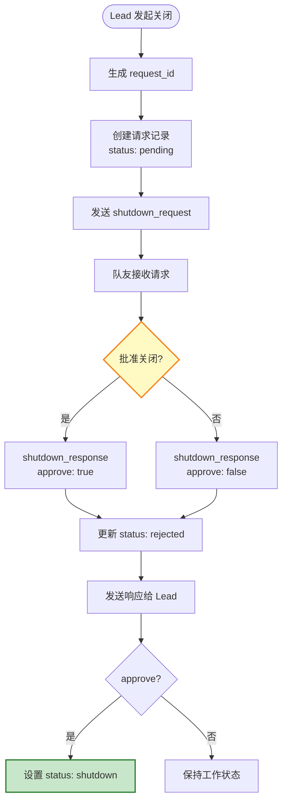
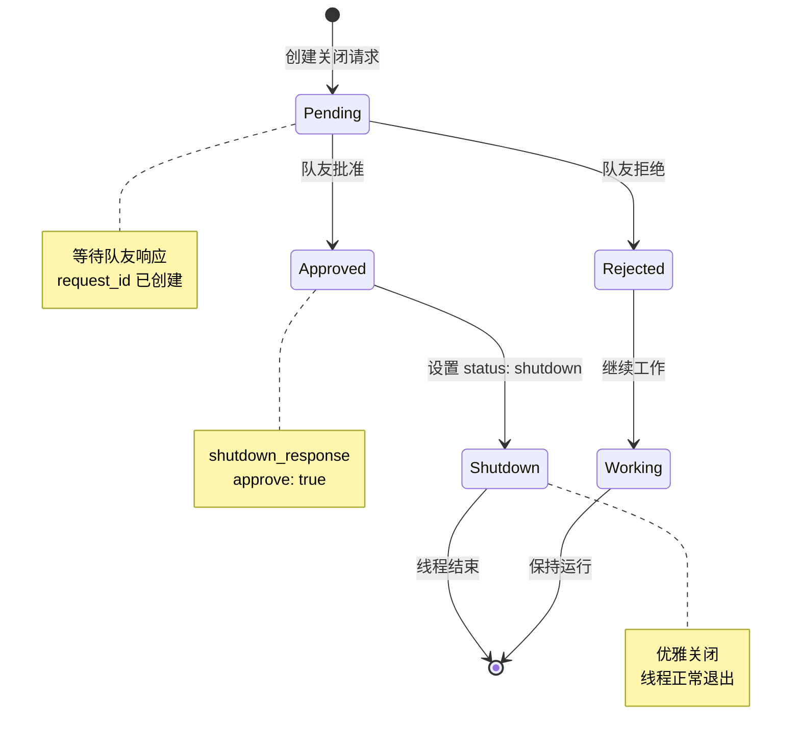
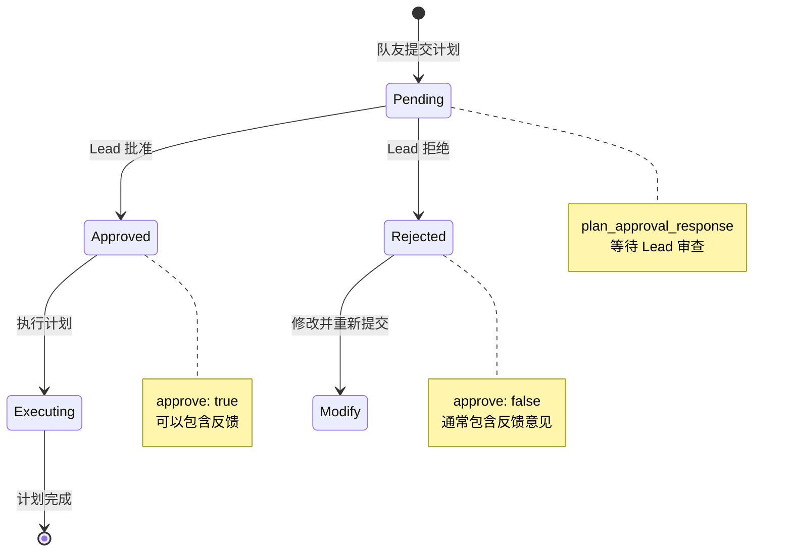

# S10 Team Protocols - 团队协议流程图

本文档描述 `s10_team_protocols.py` 的关闭协议和计划批准协议机制。

---

## 1. 系统架构概览

```mermaid
graph TB
    subgraph Shutdown["关闭协议"]
        Req["shutdown_request"]
        Resp["shutdown_response"]
        FSM["FSM: pending -> approved/rejected"]
    end

    subgraph Plan["计划批准协议"]
        Sub["plan_approval"]
        Appr["plan_approval_response"]
        PFSM["FSM: pending -> approved/rejected"]
    end

    subgraph Trackers["请求跟踪器"]
        SReq["shutdown_requests<br/>{request_id: {target, status}}"]
        PReq["plan_requests<br/>{request_id: {from, plan, status}}"]
    end

    subgraph Lock["_tracker_lock"]
        Lock["线程安全锁"]
    end

    Shutdown --> Trackers
    Plan --> Trackers
    Trackers --> Lock

    style Shutdown fill:#ffcdd2,stroke:#c62828,stroke-width:2px
    style Plan fill:#e1f5fe,stroke:#01579b,stroke-width:2px
```

---

## 2. 关闭协议流程图



---

## 3. 计划批准流程图


---

## 4. request_id 关联模式

```mermaid
sequenceDiagram
    participant R as 请求发起方
    participant T as Tracker
    participant H as 持有者
    participant L as Lock

    Note over R,T: 发起请求
    R->>T: 创建请求记录
    R->>R: 生成 request_id
    R->>T: 存储请求状态 (pending)

    Note over T,H: 响应处理
    H->>L: 获取锁
    L-->>H: 锁定
    H->>T: 更新请求状态
    H->>L: 释放锁

    Note over R,T: 关联确认
    T->>R: request_id 匹配
    R->>R: 更新本地状态

    style T fill:#e1f5fe,stroke:#01579b,stroke-width:2px
```

---

## 5. 关闭协议状态机



---

## 6. 计划批准状态机



---

## 7. 数据结构

### shutdown_requests 跟踪器
```python
shutdown_requests = {
    "abc123": {
        "target": "alice",
        "status": "pending"
    },
    "def456": {
        "target": "bob",
        "status": "approved"
    }
}
```

### plan_requests 跟踪器
```python
plan_requests = {
    "xyz789": {
        "from": "alice",
        "plan": "实现登录功能...",
        "status": "pending"
    },
    "uvw012": {
        "from": "bob",
        "plan": "重构数据库...",
        "status": "approved"
    }
}
```

### shutdown_request 消息
```json
{
    "type": "shutdown_request",
    "request_id": "abc123"
}
```

### shutdown_response 消息
```json
{
    "type": "shutdown_response",
    "request_id": "abc123",
    "approve": true,
    "reason": "工作已完成"
}
```

---

## 8. 关键特性总结

| 特性 | 说明 |
|------|------|
| **request_id 关联** | 请求和响应通过唯一 ID 匹配 |
| **FSM 模式** | pending → approved | rejected |
| **线程安全** | 使用 _tracker_lock 保护共享数据 |
| **双向确认** | 请求-响应模式确保双方同意 |
| **可追溯** | 每个请求有唯一 ID 便于跟踪 |

---

## 9. 核心洞察

> **"Same request_id correlation pattern, two domains."**
>
> 相同的 request_id 关联模式，两个领域。
