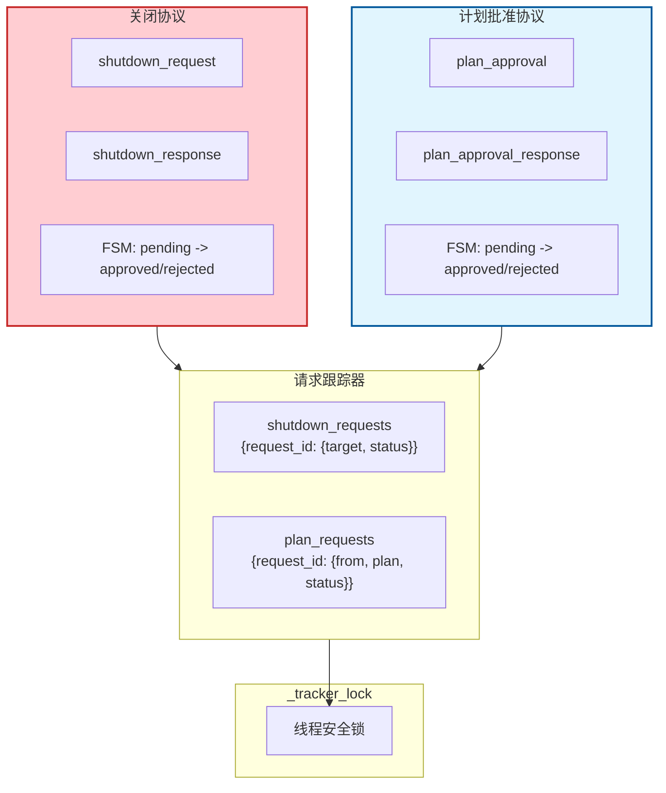
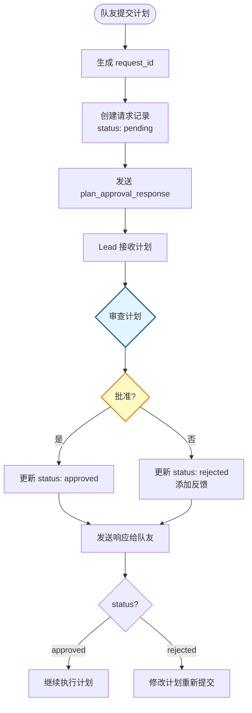
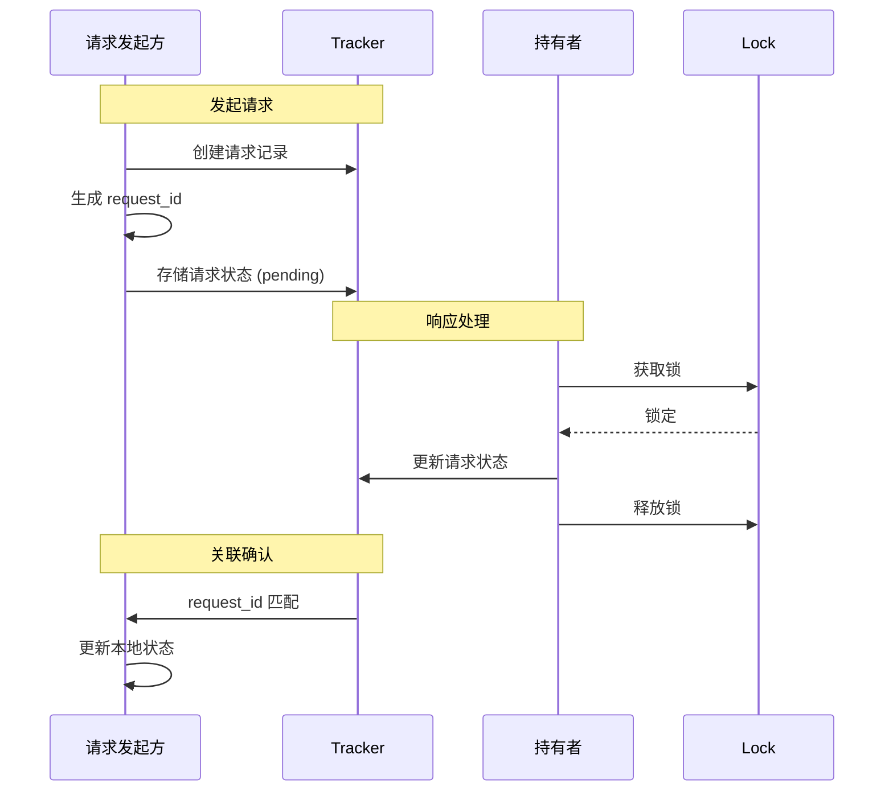
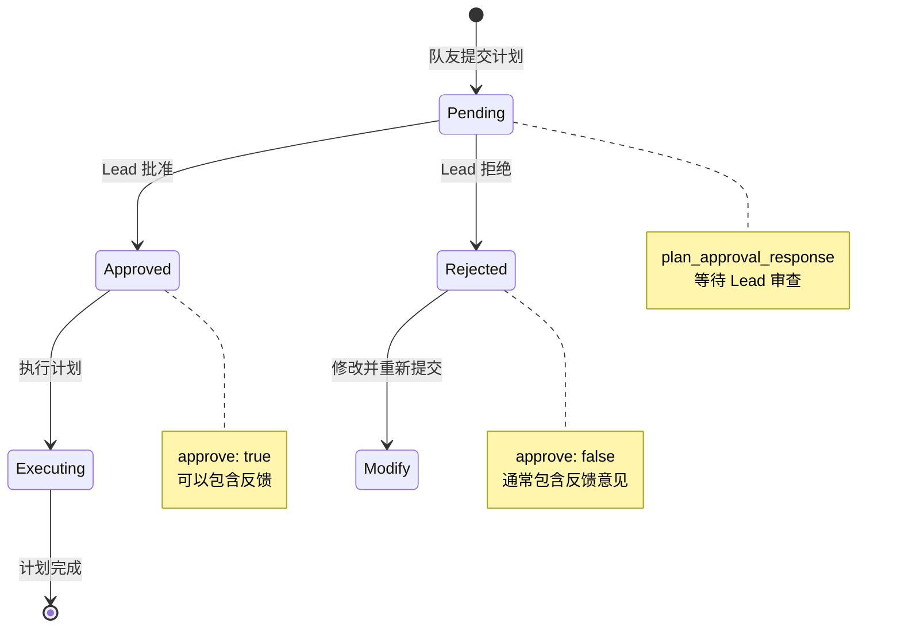

# S10 Team Protocols - 团队协议流程图
```
┌─────────────────────────────────────────────────────────────────┐
│ TEAMMATE 端                                                     │
├─────────────────────────────────────────────────────────────────┤
│ 1. LLM 调用 plan_approval 工具（参数：plan 文本）                 │
│ 2. _exec() 生成 request_id                                      │
│ 3. 存入 plan_requests[req_id] = {from, plan, status: "pending"} │
│ 4. BUS.send() 发送 {request_id, plan} 给 lead                   │
└─────────────────────────────────────────────────────────────────┘
                              ↓
┌─────────────────────────────────────────────────────────────────┐
│ LEAD 端                                                         │
├─────────────────────────────────────────────────────────────────┤
│ 1. 读取 inbox，收到 {request_id, plan}                           │
│ 2. LLM 判断，调用 plan_approval 工具（参数：request_id, approve） │
│ 3. handle_plan_review() 查 plan_requests[request_id]            │
│ 4. 更新本地 status                                              │
│ 5. BUS.send() 发送 {request_id, approve, feedback} 给 teammate  │
└─────────────────────────────────────────────────────────────────┘
                              ↓
┌─────────────────────────────────────────────────────────────────┐
│ TEAMMATE 端                                                     │
├─────────────────────────────────────────────────────────────────┤
│ 1. 循环读取 inbox，收到 {request_id, approve, feedback}          │
│ 2. LLM 根据结果执行后续操作                                       │
└─────────────────────────────────────────────────────────────────┘
```
## 你需要记住的核心点

1. **消息内容 ≠ 追踪器内容**：lead 发送给 teammate 的只有审批结果，不是"全部消息"
2. **工具调用 ≠ 消息发送**：工具是 LLM 的接口，消息发送在工具实现内部
3. **追踪器是本地状态**：`plan_requests` 只在 lead 端用于追踪，不会传给 teammate

 
**shutdown_request 完全不是上述流程！方向完全相反！**

## 两个协议的对比

```
┌──────────────────────────────────────────────────────────────┐
│                    SHUTDOWN 协议                              │
│                    Lead → Teammate                            │
├──────────────────────────────────────────────────────────────┤
│  Lead 发起                                                    │
│  ├── 生成 request_id（第353行）                                │
│  ├── 存入 shutdown_requests[req_id]                           │
│  └── BUS.send() 给 teammate                                  │
│                           ↓                                  │
│  Teammate 响应                                                │
│  ├── LLM 调用 shutdown_response 工具                          │
│  ├── 更新 shutdown_requests[req_id]["status"]                 │
│  └── BUS.send() 给 lead                                      │
└──────────────────────────────────────────────────────────────┘

┌──────────────────────────────────────────────────────────────┐
│                   PLAN APPROVAL 协议                          │
│                   Teammate → Lead                             │
├──────────────────────────────────────────────────────────────┤
│  Teammate 发起                                                │
│  ├── LLM 调用 plan_approval 工具                              │
│  ├── 生成 request_id（第249行）                                │
│  ├── 存入 plan_requests[req_id]                               │
│  └── BUS.send() 给 lead                                      │
│                           ↓                                  │
│  Lead 响应                                                    │
│  ├── LLM 调用 plan_approval 工具                              │
│  ├── 更新 plan_requests[req_id]["status"]                     │
│  └── BUS.send() 给 teammate                                  │
└──────────────────────────────────────────────────────────────┘
```

## 关键区别

| 对比项 | Shutdown | Plan Approval |
|--------|----------|---------------|
| **发起方** | Lead | Teammate |
| **request_id 生成者** | Lead（第353行） | Teammate（第249行） |
| **追踪器** | `shutdown_requests` | `plan_requests` |
| **请求消息类型** | `shutdown_request` | `plan_approval_response`（命名错误）|
| **响应消息类型** | `shutdown_response` | `plan_approval_response` |
| **流程方向** | Lead 通知 Teammate 关闭 | Teammate 请求 Lead 审批 |

## 你为什么会搞混？

两个协议虽然都用 `request_id` 匹配，但**发起方向完全相反**：

- **Shutdown**：Lead 下达命令 → Teammate 执行
- **Plan Approval**：Teammate 提交申请 → Lead 审批 


用户在问 s10 章节的核心思路是否就是通过 request_id 来匹配请求。让我确认一下这个理解是否正确。

是的，s10 的核心思想确实是：
1. 通过 request_id 实现请求-响应的关联匹配
2. 使用追踪器（shutdown_requests, plan_requests）存储请求状态
3. 跨异步消息通信实现协作

但这个实现确实是一个"简易版本"，因为：
1. 只支持两种协议（shutdown 和 plan approval）
2. 消息类型命名有错误（plan_approval_response 用于请求）
3. 没有超时处理
4. 没有持久化
5. 追踪器是全局变量，不支持多实例

用户的理解基本正确，我来确认并补充。
**基本正确，但不够完整。**

## s10 团队协议的核心设计

```
┌─────────────────────────────────────────────────────────────┐
│                    核心设计模式                              │
├─────────────────────────────────────────────────────────────┤
│                                                             │
│   请求方                      响应方                         │
│     │                          │                           │
│     │  1. 生成 request_id      │                           │
│     │  2. 存入追踪器            │                           │
│     │  3. 发送消息 ─────────>  │                           │
│     │     {request_id, ...}    │                           │
│     │                          │ 4. 处理请求                 │
│     │                          │ 5. 更新追踪器 status        │
│     │  <────────────────────   │ 6. 发送响应                 │
│     │     {request_id, result} │     {request_id, result}   │
│     │                          │                           │
│     │  7. 通过 request_id      │                           │
│     │     匹配原始请求          │                           │
│                                                             │
└─────────────────────────────────────────────────────────────┘
```

## 这个简易版本的局限性

| 问题 | 说明 |
|------|------| 
| **无超时机制** | 请求可能永远得不到响应 |
| **无持久化** | 程序重启后追踪器丢失 |
| **全局变量** | 不支持多实例，线程安全依赖锁 |
| **协议有限** | 只支持 shutdown 和 plan approval 两种 |
| **无重试机制** | 消息丢失后无法恢复 |

## 正确的理解

s10 展示的是**异步请求-响应模式的简化实现**：

1. **request_id 作为关联键** - 解决异步消息的匹配问题
2. **追踪器存储状态** - 记录请求的生命周期
3. **消息总线解耦** - 发送方和接收方通过 inbox 通信
4. **LLM 作为决策者** - 审批/关闭由 AI 判断

这个设计可以扩展到更复杂的协议场景，但当前实现确实是一个**最小可行版本**。

本文档描述 `s10_team_protocols.py` 的关闭协议和计划批准协议机制。

---

## 1. 系统架构概览



---

## 2. 关闭协议流程图


---

## 3. 计划批准流程图



---

## 4. request_id 关联模式



---

## 5. 关闭协议状态机


---

## 6. 计划批准状态机



---

## 7. 数据结构

### shutdown_requests 跟踪器
```python
shutdown_requests = {
    "abc123": {
        "target": "alice",
        "status": "pending"
    },
    "def456": {
        "target": "bob",
        "status": "approved"
    }
}
```

### plan_requests 跟踪器
```python
plan_requests = {
    "xyz789": {
        "from": "alice",
        "plan": "实现登录功能...",
        "status": "pending"
    },
    "uvw012": {
        "from": "bob",
        "plan": "重构数据库...",
        "status": "approved"
    }
}
```

### shutdown_request 消息
```json
{
    "type": "shutdown_request",
    "request_id": "abc123"
}
```

### shutdown_response 消息
```json
{
    "type": "shutdown_response",
    "request_id": "abc123",
    "approve": true,
    "reason": "工作已完成"
}
```

---

## 8. 关键特性总结

| 特性 | 说明 |
|------|------|
| **request_id 关联** | 请求和响应通过唯一 ID 匹配 |
| **FSM 模式** | pending → approved | rejected |
| **线程安全** | 使用 _tracker_lock 保护共享数据 |
| **双向确认** | 请求-响应模式确保双方同意 |
| **可追溯** | 每个请求有唯一 ID 便于跟踪 |

---

## 9. 核心洞察

> **"Same request_id correlation pattern, two domains."**
>
> 相同的 request_id 关联模式，两个领域。
