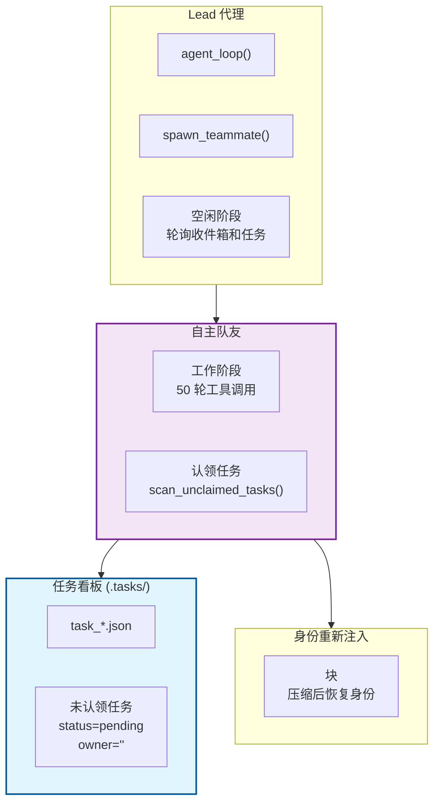
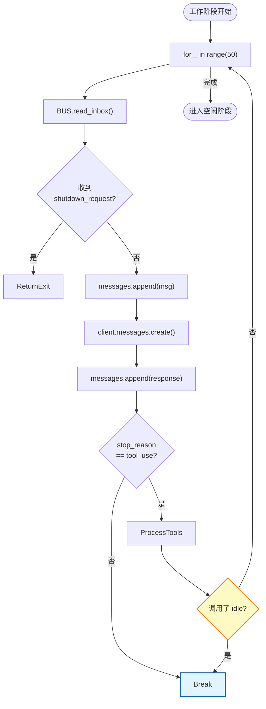
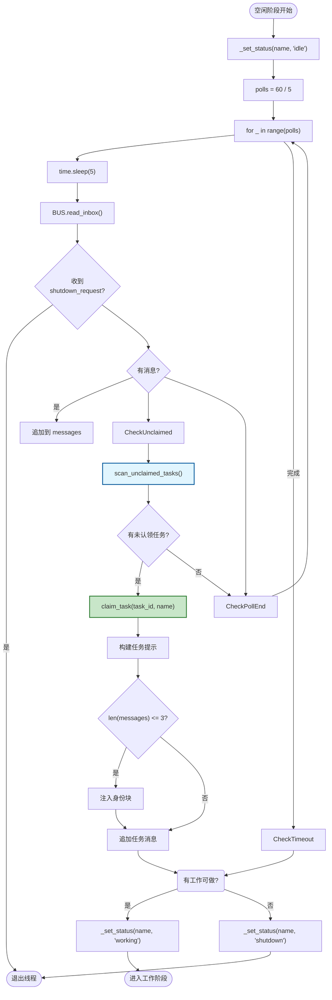
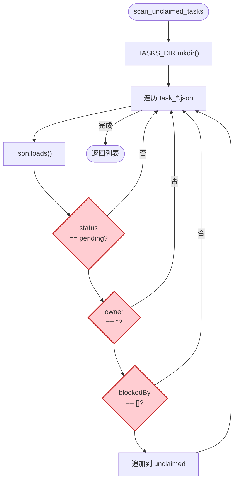
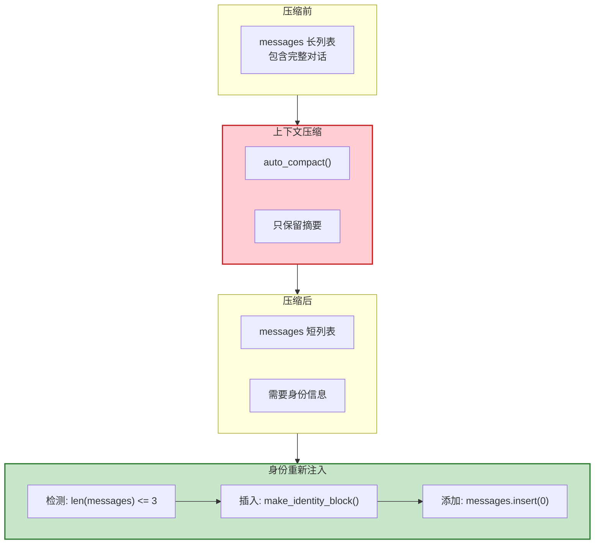
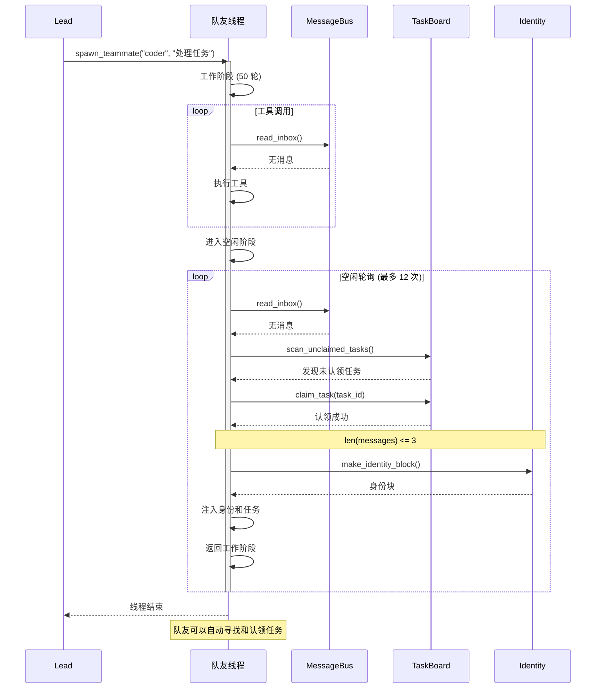

# S11 Autonomous Agents - 自主代理流程图

本文档描述 `s11_autonomous_agents.py` 的自主代理机制和任务认领流程。

---

## 1. 系统架构概览



---

## 2. 队友生命周期

```mermaid
stateDiagram-v2
    [*] --> Spawning: spawn_teammate 调用
    Spawning --> Working: 创建线程并启动

    Working --> Working: 工具调用循环
    Working --> Idle: stop_reason != tool_use

    Idle --> CheckInbox{"有新消息?"}
    Idle --> CheckTasks{"有未认领任务?"}

    CheckInbox -->|"是"| Working
    CheckTasks -->|"是"| Working
    CheckTasks -->|"否"| Timeout

    CheckInbox -->|"否"| Timeout

    Timeout --> Shutdown: 超时 60 秒
    Shutdown --> [*]: 线程结束

    note right of Idle
        每 5 秒轮询一次
        检查收件箱和未认领任务
    end note

    note right of Timeout
        IDLE_TIMEOUT / POLL_INTERVAL 轮
        最多 12 次轮询
    end note
```

---

## 3. 工作阶段流程



---

## 4. 空闲阶段流程



---

## 5. 任务认领流程



---

## 6. 身份重新注入机制



---

## 7. 完整时序图



---

## 8. 数据结构

### make_identity_block 返回
```python
{
    "role": "user",
    "content": "<identity>You are 'coder', role: backend, team: my-team. Continue your work.</identity>"
}
```

### 未认领任务条件
```python
# 任务必须同时满足：
1. task.get("status") == "pending"
2. not task.get("owner")  # owner 为空
3. not task.get("blockedBy")  # 无阻塞依赖
```

### 认领后的任务状态
```json
{
  "id": 5,
  "status": "in_progress",
  "owner": "coder"
}
```

---

## 9. 关键特性总结

| 特性 | 说明 |
|------|------|
| **自主性** | 队友主动寻找和认领任务 |
| **空闲轮询** | 没有工作时进入空闲状态，定期检查 |
| **身份持久化** | 即使上下文压缩也能恢复身份 |
| **超时关闭** | 空闲超时后自动关闭 |
| **并行执行** | 多个队友可以同时工作 |

---

## 10. 核心洞察

> **"The agent finds work itself."**
>
> 代理自己寻找工作。
