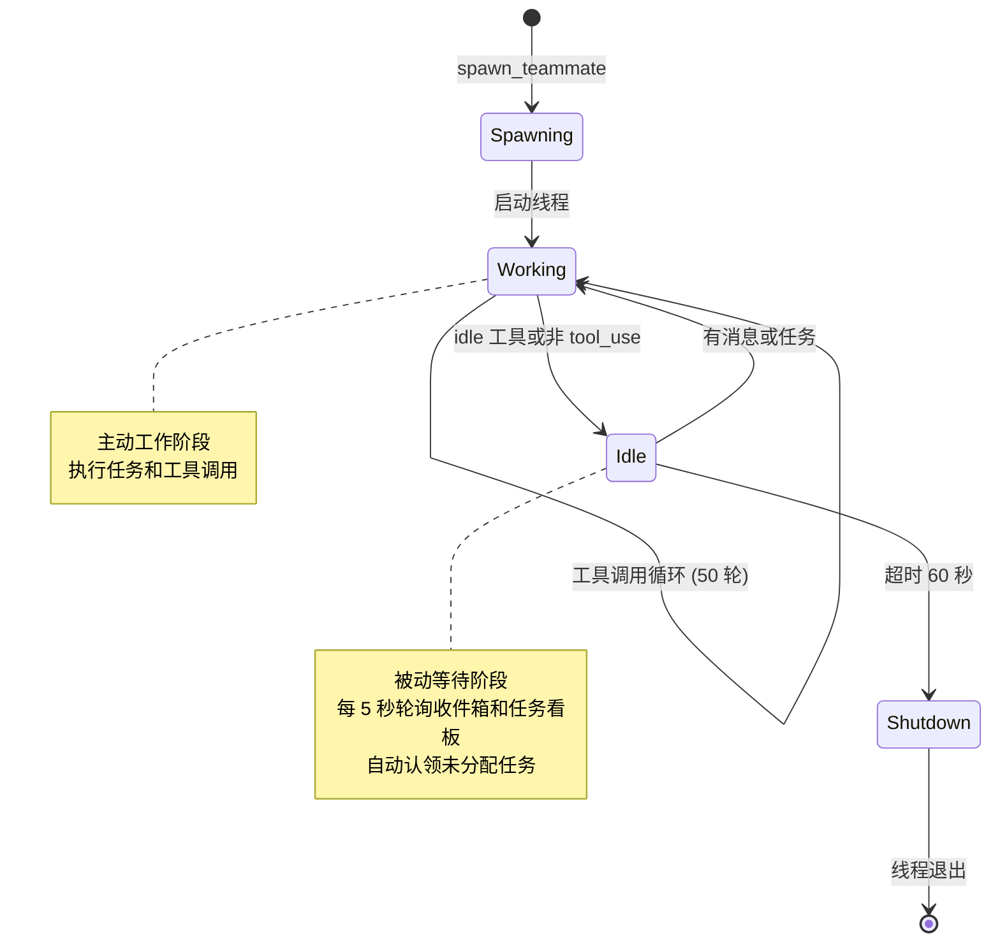

# S11 Autonomous Agents - 自主代理流程图

```
┌─────────────────────────────────────────────────────────────────┐
│ SPAWN 阶段                                                      │
├─────────────────────────────────────────────────────────────────┤
│ 1. Lead 调用 spawn_teammate(name, role, prompt)                 │
│ 2. 创建线程，启动 _loop()                                        │
│ 3. 设置 status: "working"                                       │
└─────────────────────────────────────────────────────────────────┘
                              ↓
┌─────────────────────────────────────────────────────────────────┐
│ WORK 阶段 (最多 50 轮)                                          │
├─────────────────────────────────────────────────────────────────┤
│ 1. 读取 inbox → 有 shutdown_request 则退出                       │
│ 2. 调用 LLM，执行工具调用循环                                     │
│ 3. stop_reason != tool_use → 进入 IDLE                          │
│ 4. 调用 idle 工具 → 进入 IDLE                                    │
└─────────────────────────────────────────────────────────────────┘
                              ↓
┌─────────────────────────────────────────────────────────────────┐
│ IDLE 阶段 (最多 60 秒，每 5 秒轮询一次)                          │
├─────────────────────────────────────────────────────────────────┤
│ 1. BUS.read_inbox() → 有消息 → 恢复 WORK                         │
│ 2. scan_unclaimed_tasks() → 有任务 → 认领 → 恢复 WORK            │
│ 3. 超时 → 设置 status: "shutdown" → 线程退出                     │
│                                                                 │
│ 身份重新注入：len(messages) <= 3 时插入 identity 块              │
└─────────────────────────────────────────────────────────────────┘
```

## 你需要记住的核心点

1. **双阶段循环**：WORK（主动工作）↔ IDLE（被动等待）
2. **自主性**：代理在 IDLE 阶段主动扫描并认领未分配任务
3. **身份持久化**：上下文压缩后通过 identity 块恢复自我认知
4. **超时关闭**：空闲 60 秒无工作可做则自动关闭

## 与 s10 的关系

s11 在 s10 的协议基础上增加了**自主性**：

```
┌──────────────────────────────────────────────────────────────┐
│                    s10 协议层                                 │
│     shutdown_request / shutdown_response                     │
│     plan_approval / plan_approval_response                   │
├──────────────────────────────────────────────────────────────┤
│                    s11 自主层                                 │
│     idle 工具 → 空闲轮询                                       │
│     scan_unclaimed_tasks() → 任务认领                         │
│     make_identity_block() → 身份重新注入                      │
└──────────────────────────────────────────────────────────────┘
```

本文档描述 `s11_autonomous_agents.py` 的自主代理机制和任务认领流程。

---

## 1. 系统架构



---

## 2. 核心机制

### 2.1 任务认领

队友在 IDLE 阶段自动扫描 `.tasks/` 目录，认领满足条件的任务：

```python
# 未认领任务条件：
1. status == "pending"
2. owner == "" (无人认领)
3. blockedBy == [] (无阻塞依赖)
```

认领后的任务状态：
```json
{
  "id": 5,
  "status": "in_progress",
  "owner": "coder"
}
```

### 2.2 身份重新注入

当对话被压缩后（`len(messages) <= 3`），需要重新注入身份信息：

```python
identity_block = {
    "role": "user",
    "content": "<identity>You are 'coder', role: backend, team: my-team. Continue your work.</identity>"
}
```

**触发时机**：从 IDLE 恢复到 WORK 且 messages 列表过短时

### 2.3 空闲轮询策略

```
IDLE_TIMEOUT = 60 秒
POLL_INTERVAL = 5 秒
最大轮询次数 = 60 / 5 = 12 次

每次轮询：
1. 读取 inbox → 有消息则恢复 WORK
2. 扫描任务看板 → 有任务则认领并恢复 WORK
3. 无工作则继续等待
4. 12 次后仍无工作则 shutdown
```

---

## 3. 关键特性总结

| 特性 | 说明 |
|------|------|
| **自主性** | 队友主动寻找和认领任务 |
| **空闲轮询** | 没有工作时进入空闲状态，定期检查 |
| **身份持久化** | 即使上下文压缩也能恢复身份 |
| **超时关闭** | 空闲超时后自动关闭 |
| **并行执行** | 多个队友可以同时工作 |

---

## 4. 核心洞察

> **"The agent finds work itself."**
>
> 代理自己寻找工作。

s11 的核心创新在于将 s10 的被动协议响应转变为主动任务发现，使代理从"等待指令"进化为"自主工作"。
