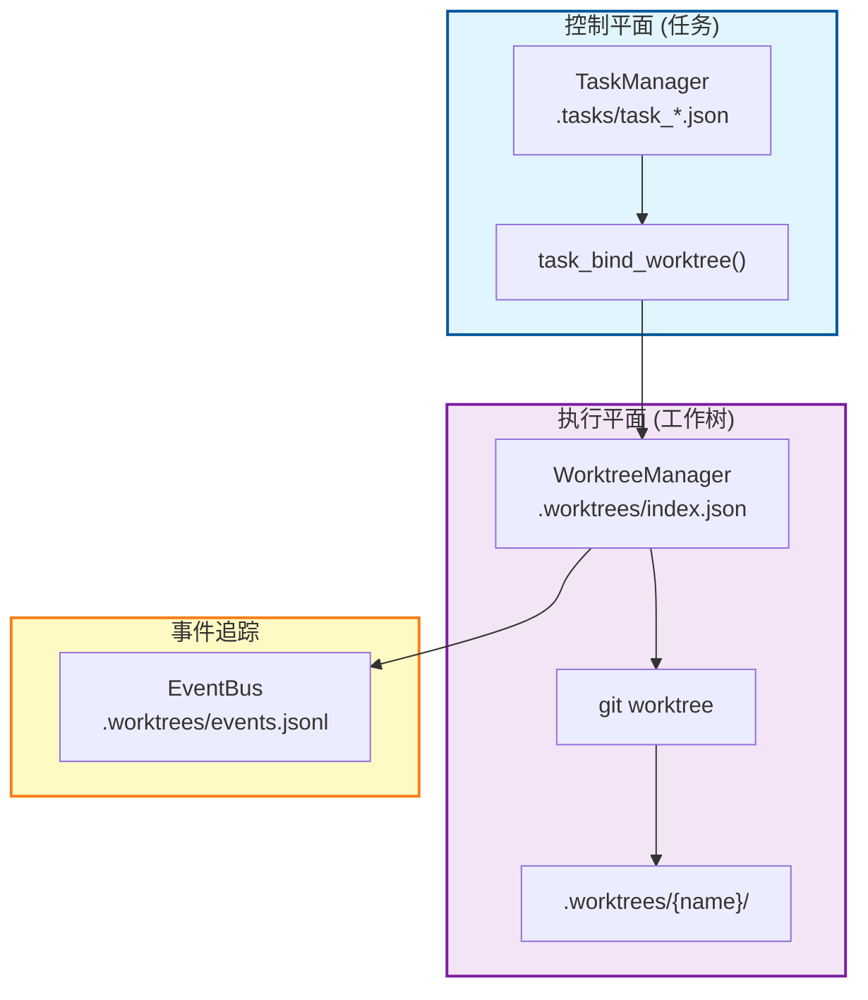
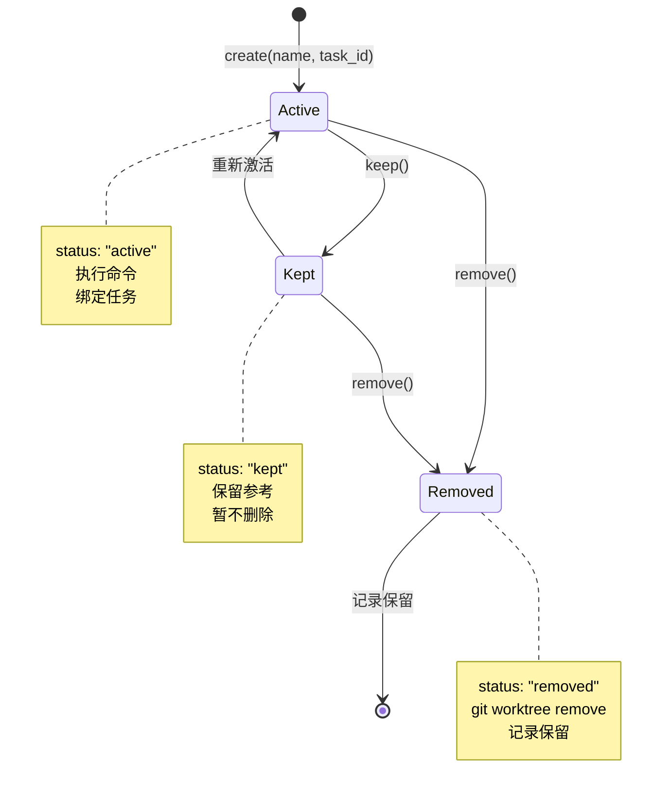

# S12 Worktree + Task Isolation - 工作树任务隔离流程图

```
┌─────────────────────────────────────────────────────────────────┐
│ 控制平面（任务）                                                 │
├─────────────────────────────────────────────────────────────────┤
│ 1. task_create() → 创建任务                                      │
│ 2. task_bind_worktree() → 绑定到工作树                           │
│ 3. task_update(status='completed') → 完成任务                    │
│                                                                 │
│ .tasks/task_*.json 存储任务状态                                  │
└─────────────────────────────────────────────────────────────────┘
                              ↓ 绑定
┌─────────────────────────────────────────────────────────────────┐
│ 执行平面（工作树）                                                │
├─────────────────────────────────────────────────────────────────┤
│ 1. worktree_create(name, task_id) → 创建 git worktree            │ 
│ 2. worktree_run(name, command) → 在独立目录执行命令               │
│ 3. worktree_remove(name, complete_task) → 清理工作树             │
│ 4. worktree_keep(name) → 保留用于参考                            │
│                                                                 │
│ .worktrees/index.json 跟踪工作树状态                             │
│ .worktrees/{name}/ 独立工作目录                                  │
└─────────────────────────────────────────────────────────────────┘
                              ↓ 记录
┌─────────────────────────────────────────────────────────────────┐
│ 事件系统                                                         │
├─────────────────────────────────────────────────────────────────┤
│ .worktrees/events.jsonl 追踪所有生命周期事件                      │
│                                                                 │
│ 事件类型：                                                       │
│ - worktree.create.before/after                                  │
│ - worktree.remove.before/after                                  │
│ - task.completed                                                │
└─────────────────────────────────────────────────────────────────┘
```

## 你需要记住的核心点

1. **双平面架构**：任务平面（控制）和工作树平面（执行）分离
2. **目录级隔离**：每个工作树有独立的目录和 Git 分支
3. **任务绑定**：任务可以绑定到工作树，实现一对一映射
4. **生命周期管理**：active（活跃）→ kept（保留）→ removed（删除）
5. **事件追踪**：所有操作都记录到事件日志，可追溯

## 与 s11 的关系

s12 在 s11 的基础上增加了**物理隔离**：

```
┌──────────────────────────────────────────────────────────────┐
│                    s11 自主层                                 │
│     空闲轮询扫描 .tasks/                                       │
│     自动认领并执行任务                                         │
├──────────────────────────────────────────────────────────────┤
│                    s12 隔离层                                 │
│     工作树隔离（git worktree）                                │
│     任务绑定（task ↔ worktree）                               │
│     事件追踪（events.jsonl）                                  │
└──────────────────────────────────────────────────────────────┘
```

**关键区别**：
- s11：多个代理在同一工作目录并行工作
- s12：每个任务在独立的工作树目录中工作，互不干扰

本文档描述 `s12_worktree_task_isolation.py` 的目录级隔离和任务绑定机制。

---

## 1. 双平面架构



---

## 2. 工作树生命周期



---

## 3. 核心机制

### 3.1 工作树创建

```python
worktree_create(name, task_id=None, base_ref="HEAD")
```

**创建流程**：
1. 验证名称合法性（1-40 字符，字母数字 ._-）
2. 检查工作树是否已存在
3. 如果有 task_id，验证任务存在
4. 发送 `worktree.create.before` 事件
5. 执行 `git worktree add -b wt/{name} {path} {base_ref}`
6. 更新 `.worktrees/index.json`
7. 如果有 task_id，绑定任务到工作树
8. 发送 `worktree.create.after` 事件

### 3.2 任务绑定

```python
task_bind_worktree(task_id, worktree, owner="")
```

**绑定效果**：
- 任务记录 `worktree` 字段设置为工作树名称
- 任务状态从 `pending` 变为 `in_progress`
- 可选设置 `owner` 字段

**数据关联**：
```json
// .tasks/task_1.json
{
  "id": 1,
  "worktree": "auth-refactor",
  "status": "in_progress"
}

// .worktrees/index.json
{
  "name": "auth-refactor",
  "task_id": 1,
  "status": "active"
}
```

### 3.3 工作树清理

```python
worktree_remove(name, force=False, complete_task=False)
```

**清理流程**：
1. 发送 `worktree.remove.before` 事件
2. 执行 `git worktree remove [--force] {path}`
3. 如果 `complete_task=True`：
   - 更新任务状态为 `completed`
   - 解绑任务的工作树
   - 发送 `task.completed` 事件
4. 更新工作树状态为 `removed`
5. 发送 `worktree.remove.after` 事件

### 3.4 事件追踪

所有操作都记录到 `.worktrees/events.jsonl`：

```json
{
  "event": "worktree.create.after",
  "ts": 1678901234.567,
  "task": {"id": 1},
  "worktree": {
    "name": "auth-refactor",
    "path": "/path/to/.worktrees/auth-refactor",
    "branch": "wt/auth-refactor",
    "status": "active"
  }
}
```

**事件类型**：
- `worktree.create.before/after`
- `worktree.create.failed`
- `worktree.remove.before/after`
- `worktree.remove.failed`
- `worktree.keep`
- `task.completed`

---

## 4. 数据结构

### .worktrees/index.json
```json
{
  "worktrees": [
    {
      "name": "auth-refactor",
      "path": "/repo/.worktrees/auth-refactor",
      "branch": "wt/auth-refactor",
      "task_id": 1,
      "status": "active",
      "created_at": 1678901234.567
    }
  ]
}
```

### task_N.json（带工作树绑定）
```json
{
  "id": 1,
  "subject": "实现登录功能",
  "description": "添加用户认证",
  "status": "in_progress",
  "owner": "alice",
  "worktree": "auth-refactor",
  "blockedBy": [],
  "blocks": [],
  "created_at": 1678901234.567,
  "updated_at": 1678901234.567
}
```

---

## 5. 关键特性总结

|| 特性 | 说明 |
||------|------|
|| **目录级隔离** | 每个工作树有独立的 Git 分支和工作目录 |
|| **任务绑定** | 任务与工作树一对一映射，便于追踪 |
|| **生命周期管理** | active → kept → removed 三态流转 |
|| **事件追踪** | 所有操作记录到 events.jsonl，可追溯 |
|| **Git 集成** | 使用 git worktree 原生实现隔离 |

---

## 6. 核心洞察

> **"Isolate by directory, coordinate by task ID."**
>
> 通过目录隔离，通过任务 ID 协调。

s12 的核心创新是实现了物理层面的工作隔离。与 s11 的逻辑隔离（同目录、不同队友）不同，s12 让每个任务在独立的 Git worktree 中工作，从根本上解决了文件冲突问题。
