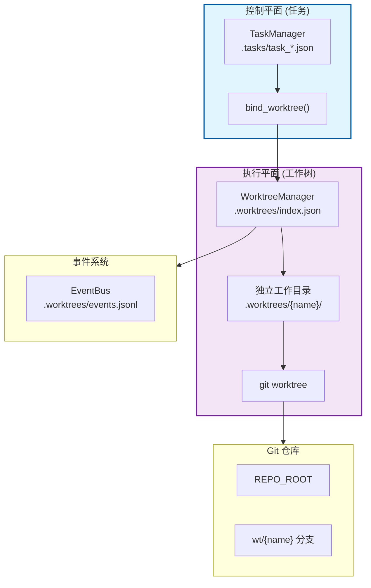
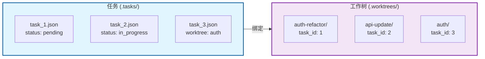
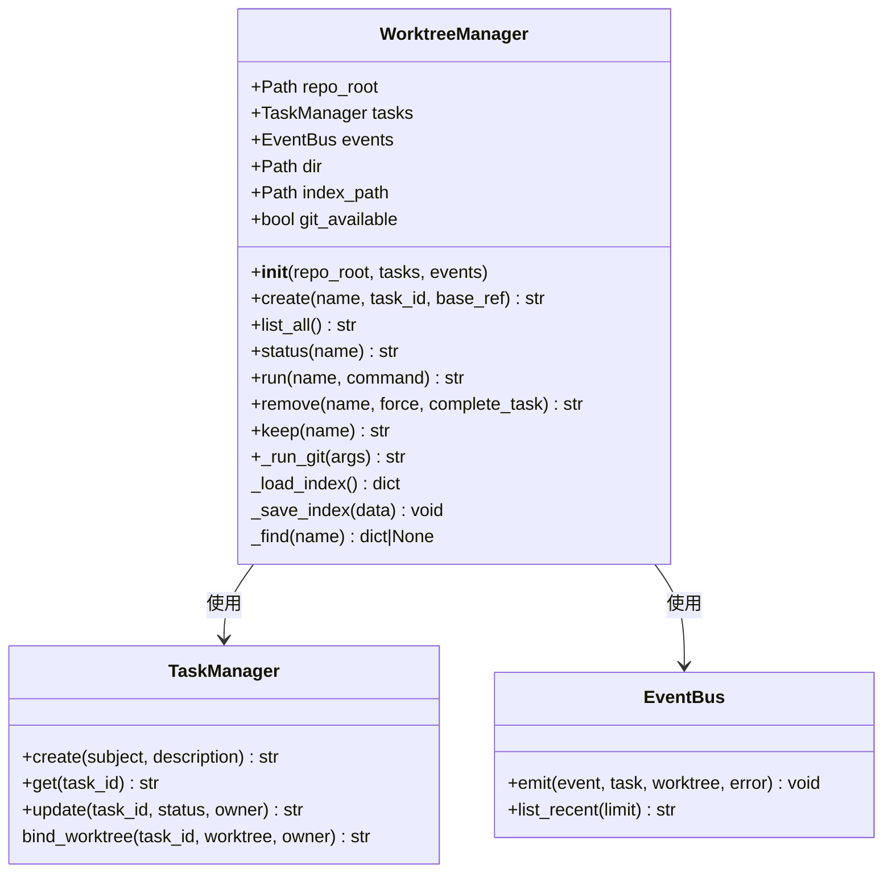
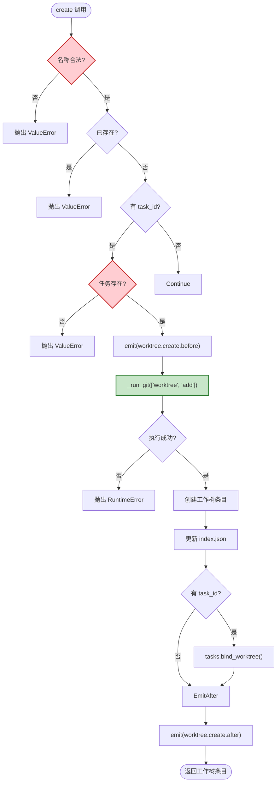
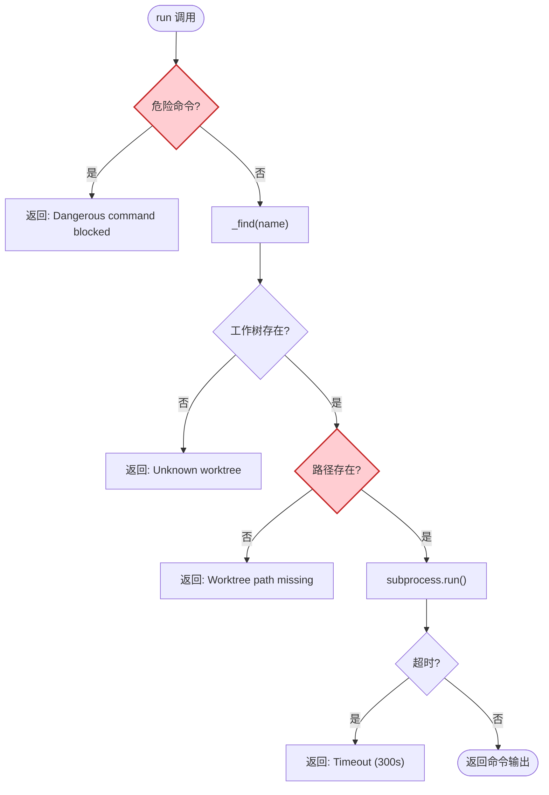
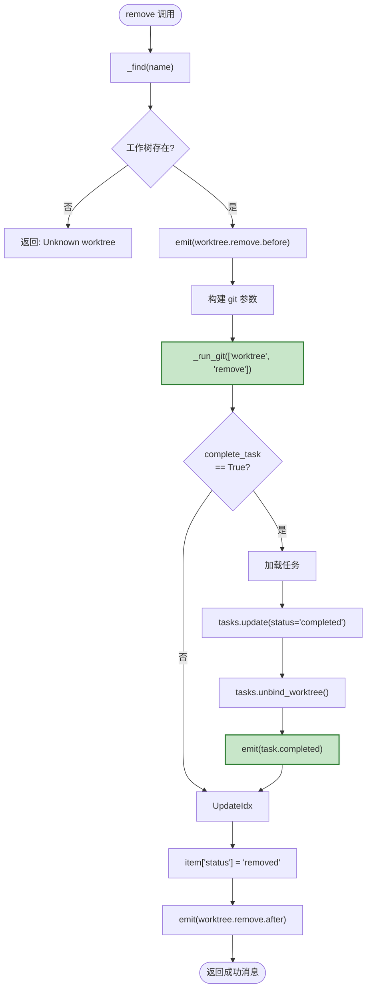
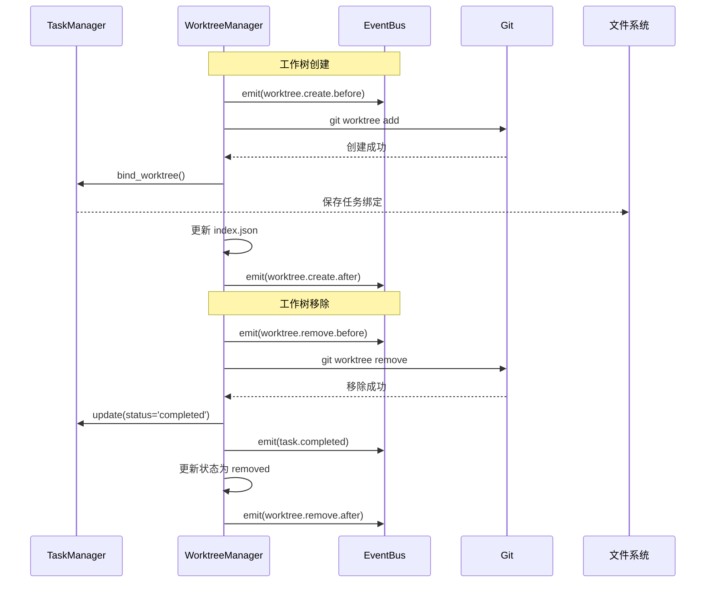
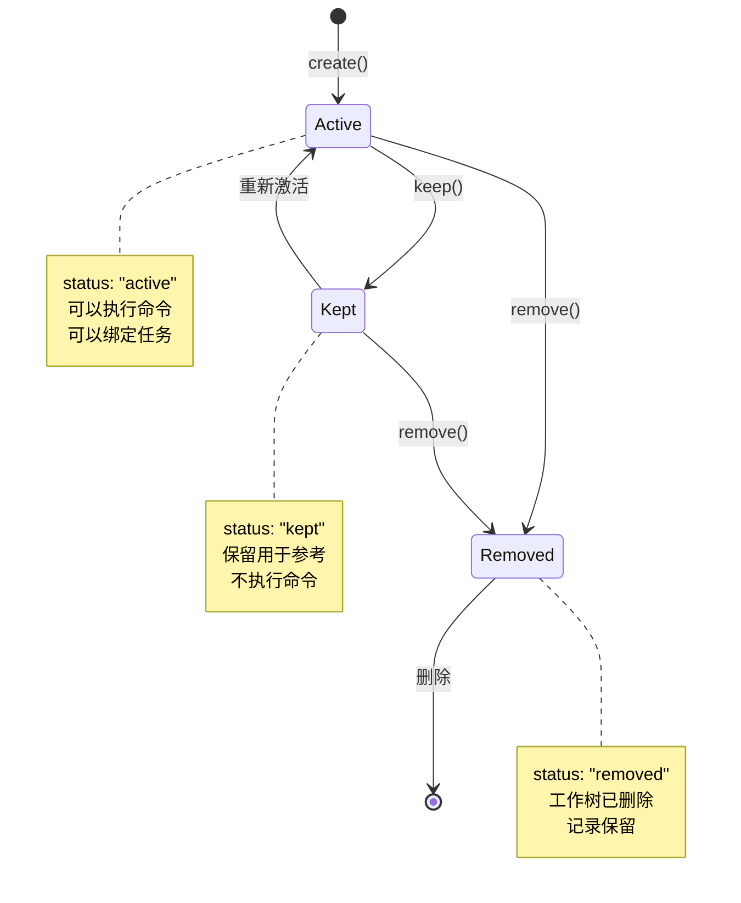

# S12 Worktree + Task Isolation - 工作树任务隔离流程图

本文档描述 `s12_worktree_task_isolation.py` 的目录级隔离和任务绑定机制。

---

## 1. 系统架构概览



---

## 2. 双平面架构



---

## 3. WorktreeManager 类结构



---

## 4. 工作树创建流程 (create)



---

## 5. 工作树执行流程 (run)



---

## 6. 工作树移除流程 (remove)



---

## 7. 事件流



---

## 8. 工作树生命周期



---

## 9. 数据结构

### .worktrees/index.json 结构
```json
{
  "worktrees": [
    {
      "name": "auth-refactor",
      "path": "/path/to/.worktrees/auth-refactor",
      "branch": "wt/auth-refactor",
      "task_id": 1,
      "status": "active",
      "created_at": 1678901234.567
    }
  ]
}
```

### task_N.json (带工作树绑定)
```json
{
  "id": 1,
  "subject": "实现登录功能",
  "description": "添加用户认证",
  "status": "in_progress",
  "owner": "alice",
  "worktree": "auth-refactor",
  "blockedBy": [],
  "blocks": [],
  "created_at": 1678901234.567,
  "updated_at": 1678901234.567
}
```

### 事件日志结构
```json
{
  "event": "worktree.create.after",
  "ts": 1678901234.567,
  "task": {"id": 1},
  "worktree": {
    "name": "auth-refactor",
    "path": "/path/to/.worktrees/auth-refactor",
    "branch": "wt/auth-refactor",
    "status": "active"
  }
}
```

---

## 10. 关键特性总结

| 特性 | 说明 |
|------|------|
| **目录级隔离** | 每个工作树有独立的工作目录 |
| **任务绑定** | 任务可以绑定到工作树 |
| **生命周期管理** | active → kept → removed |
| **事件追踪** | 所有操作都记录事件日志 |
| **Git 集成** | 使用 git worktree 管理工作树 |

---

## 11. 核心洞察

> **"Isolate by directory, coordinate by task ID."**
>
> 通过目录隔离，通过任务 ID 协调。
